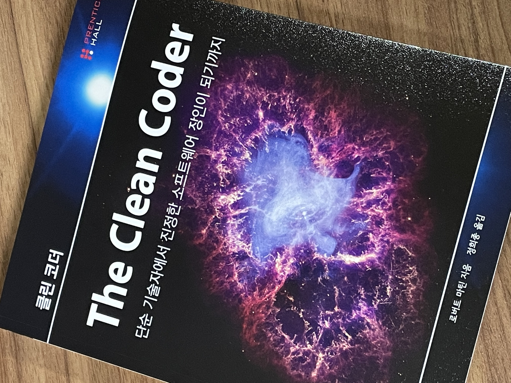

# 책 소개

**클린 코더, 로버트 마틴**



## 첫 주 차 (~ 22.05.12)

## 목차

- [1. 프로의 마음가짐](#1-프로의-마음가짐)
- [2. 아니라고 말하기](#2-아니라고-말하기)
- [3. 예라고 말하기](#3-예라고-말하기)
- [4. 준비된 자세](#4-준비된-자세)
- [5. 테스트 주도 개발](#5-테스트-주도-개발)
- [6. 연습](#6-연습)
- [7. 인수테스트](#7-인수테스트)

## 미리 읽어두기

프로 프로그래머의 핵심은 태도, 원칙, 행동이다

## 1. 프로의 마음가짐

p46. 책임감을 가져라

- 책임을 지지 않았을 떄 생기는 고통을 몸소 겪으며 ‘책임진다’는 말의 의미를 배웠다
- 소프트웨어를 제때 선적하려고 야간 작업 테스트를 빼먹었기 때문이다
- 선적 일정을 맞추려 무리하다 보니 어쩔 수 없이 테스트를 건너뛰게 됐다
- 선적하기 전 테스트를 했더라면, 데이터 손실도 없을 것이고 진역 서비스 매니저들이 지금처럼 ‘톰’을 들들 볶는 일도 없었을 것이다.

p.49 무엇보다도 해를 끼치지 마라

- 소프트웨어 개발자는 소프트웨어 관점으로 보자면 기능과 구조 양쪽에 해를 끼칠 수 있다

p.50 기능에 해를 끼치지 마라

- 사람들이 우리에게 월급을 주는 이유는 생각한대로 잘 돌아가는 소프트웨어를 만들어내길 바라기 때문이다
- 프로가 되려면 오류를 만들면 안된다
- 완벽한 사람이 될 수는 없지만, 완벽하지 않다는 사실에 책임을 져야 한다는 것이다
- 완벽한 소프트웨어를 만드는 일이 사실상 불가능하다는 것이지 완벽하지 않아도 괜찮다는 뜻은 아니다
- 같은 오류를 반복하면 안 된다

p.51 QA는 아무것도 찾지 못해야 한다

- 소프트웨어를 출실할 때는 QA가 문제를 찾지 못할 것이라고 어느 정도 자신할 수 있어야 한다
- 어떤 이들은 QA를 오류를 찾는 용도로 사용한다
- 그런 사람들은 코드를 철저히 확인하지 않고 QA에게 보낸다
- 오류를 찾아내 개발자에게 알려주는 QA에 의존한다
- 잘 돌아가는지 아닌지도 모르는 코드를 QA에게 보내는 개발자는 프로가 아니다
- ‘해를 끼치지 마라’는 규칙을 어기는 것이다

p.51 제대로 작동하는지 아닌지 알아야 한다

- 테스트하고 또 테스트하라
- 테스트를 자동화해야 한다
- 순식간에 실행할 수 있는 테스트를 만들고 가능한 자주 돌려라
- 어떤 코드는 테스트하기 어렵지 않나? 그렇다. 하지만 그 이유는 코드를 테스트하기 어렵게 설계했기 때문이다
- 해결책은 테스트하기 쉽게 코드를 설계하는 것이다
- 가장 좋은 방법은 테스트 코드를 먼저 작성한 다음, 그 테스트를 통과하도록 코드를 작성하는 것이다
- 이것이 테스트 주도 개발 즉 TDD(Test Driven Development)로 알려진 원칙이다

p.53 구조에 해를 끼치지 마라

- 전체 구조(structure)를 희생하면서까지 기능을 추가하는 일이 헛수고라는 사실은 프로라면 당연히 알고 있다
- 변경을 할 때 터무니없는 비용을 치르지 않고 변경할 수 있어야 한다
- 코드를 조금 바꾸는 일은 언제 해야 할까? 항상 해야 한다! 모듈을 살펴볼 때마다 작고 가벼운 변화를 더해 구조를 개선해야 한다
- 코드를 읽을 때마다 구조를 바꿔야 한다
- 정말 위험한 일은 소프트웨어를 고정된 상태로 두는 일이다
- 소프트웨어를 구부리지 않는다면, 정말 변화가 필요할 때, 소프트웨어가 단단히 굳어있을 것이다
- 왜 개발자들은 코드 바꾸기를 무서워할까? 코드를 망가트릴까 봐 겁이 나서다! 왜 코드를 망칠까 봐 겂이 날까? 테스트가 없기 때문이다

p.55 직업 윤리

- 자신의 경력은 자신이 책임져야 한다
- 어떤 회사는 공부할 시간을 주기도 한다
- 심지어는 시간을 내 강제로 공부를 시키는 회사도 있다
- 회사가 호의를 베푸는 것이니 감사한 마음을 가져야 한다
- 한 주에 60시간 일할 계획을 짜야 한다 (근무 40 + 개인 공부 20)

p.57 전산 분야 지식을 익혀라 (프로 소프트웨어 개발자라면 알아야 하는 최소한의 기술 목록이다)

- 디자인 패턴: 24가지 GOF 패턴을 설명할 수 있고, POSA 패턴을 실무에 적용할 수준으로 알아야 한다
- 설계 원칙: SOLID 객체지향 원칙을 알아야 하고 컴포넌트 개념을 충분히 이해해야 한다
- 방법론: XP, 스크럼, 린, 칸반, 폭포수, 구조적 분석, 구조적 설계 개념을 충분히 이해해야 한다
- 원칙: 테스트 주도 개발(TDD), 객체지향 설계, 구조적 프로그래밍, 지속적 통합, 짝 프로그래밍을 실천해야 한다
- 도구: UML, 데이터 흐름도(DFD), 구조 차트(Structure Chart), 페트리 넷(Petri Net), 상태전이 다이어그램과 테이블(State Transition Diagram and Table), 흐름도(flow chart), 결정 테이블(decision table)을 어떻게 쓰는지 알아야 한다
- **새 원칙과 기술을 익히지 못한 개발자에게 재난이 있으라**
- 그들이 내리막길을 걷는 동안 동료들은 저만치 앞서 나간다

p.60 멘토링, 업무 지식을 익혀라

- 프로라면 후배들을 멘토링하는 책임을 져야 한다
- 후배들이 방치된 채 이리저리 떠돌게 둬선 안 된다
- 새로운 분야에서 프로젝트를 시작하게 되면, 관련 분야의 책을 한두 권 읽어보자

## 2. 아니라고 말하기

p.66

- 프로라면 권위에 맞서 진실을 말해야 한다. 프로는 관리자에게 아니라고 말하는 용기를 가져야 한다
- 노예들에겐 아니라는 말이 허락되지 않는다. 단순 일꾼들은 아니라고 말하길 꺼린다. 하지만 프로는 아니라고 말해야 마땅하다
- 아니라고 말하는 일이야말로 맡은 작업을 완료하는 유일한 길이다

p.66 반대하는 역할

- 그 검토자는 대립관계가 없는 팀을 꾸린 적이 있다고 했다. 충돌 없이 조화를 이뤄 함께 일하는 그런 팀 말이다. 멋진 일이긴 하지만 정말 생각만큼 팀에 대립이 없었는지는 의문스럽다
- 프로라면 자신의 목적 달성을 위해 자신이 할 수 있는 최선을 다 해 적극적으로 추진하고 방어한다
- 관리자가 내일까지 로그인 페이지를 완성해야 된다고 말했다면, 프로그래머는 목적 달성을 위해 추진하고 방어한다
- 로그인 페이지를 내일까지 완성하는 일이 불가능하다는 사실을 충분히 알고 있다면, “좋아요, 한번 해볼게요.” 라고 말하는 것은 맡은 업무를 처리하는 것이 아니다
- 일을 제대로 처리하는 방법은 **“아니요, 불가능합니다.”** 라고 말하는 것이다

```
마이크: "폴라, 로그인 페이지를 내일까지 끝내야 해요"

폴라: "안 돼요, 마이크. 2주나 걸리는 작업이라고요."

마이크: "2주나요? 설계팀은 3일 걸린다고 추정했고, 벌써 5일이나 지났어요."

폴라: "설계팀이 틀렸어요, 마이크. 제품 마케팅 부서에서 요구사항을 추가하기 전에 추정한 일정이잖아요
그 요구사항을 처리하려면 10일이 더 필요해요. 내가 위키에 일정 갱신한 거 안 봤어요?"

마이크: "말도 안 돼요, 폴라. 내일 고객 시연에서 로그인 페이지가 잘 동작하는 걸 보여줘야 해요."

폴라: "로그인 페이지에서 내일까지 필요한 기능이 어떤 거에요?"

마이크: "로그인 페이지가 필요하다고요! 로그인할 수 있어야 돼요."

폴라: "마이크, 로그인만 가능한 데모 페이지는 만들 수 있어요. (...) 회사 뉴스 배너 기능도 없고,
도움말 버튼이나 마우스 커서를 올렸을 때 툴팁이 나오는 기능도 없어요. 그래도 로그인을 할 수 있어요.
이 정도면 되나요?"

마이크: "로그인할 수 있나요?"

폴라: "네, 로그인할 수 있어요."

마이크: "그럼 충분해요 폴라, 이제 살았네요!"
```

- 가능한 최선의 결과를 이끌어냈다. 아니라고 말하며 상호 합의하에 해결책을 만들었다. 언쟁을 좀 했고, 어색한 순간도 몇 번 있었지만, 목표가 완벽히 정의되지 않은 상황에서 적극적으로 목적 달성을 위해 노력하는 사람들 사이에서는 당연히 일어나는 일이다

```
"한번 노력해볼게요"
```

- **'노력해본다'** 는 많은 의미를 내포하고 있다. 상대방으로 하여금 해당 기한까지 가능하다는 의미로 해석이 될 수 도 있다
- 노력한다는 약속은 지금까지는 늑장을 부렸으며 힘을 비축했다고 인장하는 셈이다. 노력한다는 약속은 추가로 힘을 쏟기만 하면 목표를 달성할 수 있다고 인정할 뿐만 아니라, 추가로 힘을 쏟아 목표를 달성하기 위해 온 몸을 바치겠다고 말하는 셈이다.
- ‘노력’해도 원하는 결과를 만들지 못하면 실패다

## 3. 예라고 말하기

p.93 약속을 뜻하는 말

- 말하고 진심을 담고 실행하라
- 약속을 하는 행동은 세 부분으로 나뉜다

1. 하겠다고 말한다
2. 진심을 담는다
3. 실제로 실행한다

- 하지만 이 세 단계를 거치지 않는 사람들을 너무 자주 만나지 않는가?
- IT 담당자에게 네트워크가 왜 이렇게 느리냐고 물어보면 “그러게요. 진짜로 새 라우터를 사야 한다니까요.” 라고 대답한다. 당신은 세 단계 중 어떤 것도 일어나지 않으리라는 사실을 눈치챈다.

p.94 약속이 부족함을 알아차리기

- 뭔가를 하겠다고 약속할 때 사용하는 언어는 실제 일어날 일을 알려주는 표시이므로 잘 살펴야 한다
- 필요/해야 한다: **“이걸 끝내야 해”, “누군가는 해야 해”**
- 희망/바람: **“내일까지 끝나면 좋겠는데.”, “시간이 좀 더 있었으면 좋겠어.”**
- 하자: **“언제 한번 만나자.”, “이거 끝내자.”**
- 우리는 아무 책임도 지지 않으려 아주 바쁜 척 하는 경향이 있다 그리고 자신이나 다른 사람이 업무를 볼 때 그 약속을 믿고 의지하는 일은 바람직하지 않다.
- 약속이 아닌 말이 어떤지 살펴봤다. 그렇다면 진정한 약속을 담은 말은 어떻게 구별할 수 있을까?

p.95 약속을 뜻하는 말은 어떤 말인가?

- 앞선 문장에서 공통된 부분은 ‘내’ 손을 벗어난 일이라는 표현이거나 개인적으로 책임을 지지 않으려는 표현이다
- 스스로 언제나 자신이 제어할 수 있는 무언가가 있어서, 항상 뭔가를 해내겠다고 약속할 여지가 남아 있다
- 진심으로 하는 약속인지 아닌지 구별하는 비법은 문장에서 ‘**나는 언제까지 할 것이다**’ 라는 말을 찾아보는 것이다 **(예: 나는 이번 화요일까지 끝내겠다)**
- 이 문장의 핵심은 **명확한 마감 시간을 언급하고 그 시간까지 뭔가를 하겠다는 사실을 서술한 점이다**
- ‘가능하면’ 끝내겠다거나 ‘어쩌면 끝난다’는 말이 아니라, 꼭 완수하려는 의지를 담았다

p.97 가끔은 어쩔 도리가 없을 때도 있어서 안 될 거야

- 약속을 지키지 못하겠다면, 당장 약속한 사람에게 경고의 붉은 깃발을 휘두르는 일이 가장 중요하다
- 정오에 시내 카페에서 동료들과 회의하기로 했는데 차가 막혀 약속 시간을 맞출 수 있을지 의구심이 든다. 늦을지도 모른다는 생각이 든다면 즉시 동료에게 전화를 걸어 알려야 한다. 가까운 장소로 바꾸거나 회의를 연기할 수 있다
- 약속의 뜻을 담은 언어의 사용은 얼핏 두려워 보이지만, 오늘 프로그래머들이 맞닥뜨리는 여러 의사소통 문제들, 즉 추정, 마감일, 마주보고 하는 대화에서 생기는 사고를 해결하는데 도움이 된다. 내뱉은 말은 지키는 진지한 개발자로 인정받게 되고, 이는 이 업계에서 개발자들이 바라는 최고의 일이다

p.103 결론

- 프로는 모든 업무 요청에 예라고 대답할 필요가 없다
- 하지만 “예”라고 대답할 수 있는 창의적인 방법을 찾는 데 고심해야 한다
- 프로가 예라고 대답할 때는 약속을 뜻하는 언어를 사용해서 내뱉은 말에 모호한 부분이 없도록 해야 한다

## 4. 준비된 자세

p.106

- 오랜 시간 연습하다 보니, 보지 않고 타이핑하는 비결은 자신감이라는 사실을 깨달았다
- 오류를 느끼는 감각은 정말 중요하다. 오류 감각을 가진다는 사실은 피드백 루프를 재빨리 끝내 오류에서 배움을 얻는 일이 더 빨라진다는 뜻이다
- 어떤 일에 통달하는 비법은 자신감과 오류를 느끼는 감각이라는 사실을 깨달았다

p.106 준비된 자세

1. 코드는 반드시 동작해야 한다. 풀고자 하는 문제가 어떤 문제며 어떻게 풀어야 하는지 확실히 이해해야 한다.
2. 코드는 고객이 제시한 문제를 반드시 풀어야 한다
3. 코드는 기존 시스템에 잘 녹아들어야 한다. 코드는 견고한 (SOLID) 객체지향 원칙을 따라야 한다
4. 코드는 다른 프로그래머가 읽기 쉬워야 한다. 주석을 잘 쓰라는 단순한 조언이 아니다. 만든 사람의 의도가 드러나도록 코드를 잘 다듬어야 한다는 뜻이다.

p.108 새벽 3시에 짠 코드

- 내가 짠 코드 중 가장 엉망이었던 코드는 새벽 3시에 짠 코드였다
- 당시에는 오랜 시간 일한 자신이 대견했다. 헌신한다는 느낌이었다. 새벽 3시까지 일하는 것을 진지한 프로의 모습이라 생각했다. 얼마나 어처구니 없는 생각인가!
- 그때 만든 코드는 두고두고 골칫거리가 됐다. 잘못된 설계 구조 때문에 모두가 우회로를 찾아야 했다
- 이 이야기의 핵심은 다음과 같다. **지쳤을 때는 코드를 만들지 마라. 헌신과 프로다운 모습은 무턱대고 많이 일하는 데서가 아니라 원칙을 지키는 모습에서 나온다. 충분히 자고 건강을 챙기고 건전한 생활 습관으로 하루에 8시간씩 충실히 일하자**

p.110 몰입 영역

- **‘몰입’은 프로그래머들이 코딩을 하는 동안 빠져드는 고도로 집중한 의식의 터널시야 상태다. 이 상태에서 그들은 생산적이라 느낀다. 자신이 옳다고 느낀다**
- 몰입 경험을 꽤나 해본 사람으로서 여러분에게 조언을 하나 하고 싶다. 몰입에 빠지지 마라
- 몰입 영역에 빠지면 더 많은 코드를 쓰려 한다. 잔잔한 도취감이나 정복감을 느껴랴 한다. 문제는 영역에 빠진 상태에서는 큰 그림을 놓쳐, 나중에 되돌려야 할 결정을 내리기 쉽다는 점이다
- **영역에 빠진 상태에선 빠르게 코드를 만들지만, 나중에 다시 들러 살펴야 할 것이다**
- 팀에서 일한다면 짝 프로그래밍을 해야 한다. 짝 프로그래밍이 주는 여러 이점 중 하나는 영역에 빠질 가능성이 없다는 점이다

p.112 외부 방해

- 무례한 반응은 종종 영역에 빠져 있을 때 나온다. 영역에서 끌려 나왔거나 영역에 들어가려는 시도가 방해를 받아서 짜증이 났을 것이다
- 물론 외부 방해는 어떻게든 찾아와서 우리를 산만하게 만들고 시간을 낭비하게 만든다
- **방해가 찾아오면, 다음 번에는 자신이 남을 방해할 필요가 있을지도 모른다는 사실을 기억하라. 그래서 프로다운 태도로 예의 바르게 기꺼이 도와야 한다.**

p.119 속도 조절

- 소프트웨어 개발은 마라톤이지 단거리 질주가 아니다
- 시작부터 있는 힘껏 빨리 달려서는 시합에서 이길 수 없다
- 자원을 보존하고 속도를 조절해야 이긴다
- 마라톤 주자는 시합 전과 시합 도중 양쪽에서 자기 몸을 보살핀다. 프로 프로그래머는 기력을 보존하고 창의성도 챙긴다

p.119 언제 걸어 나가야 할지 알기

- 풀고 있는 문제를 다 풀기 전에는 집에 못 간다고? 아니다. 가도 된다. 그리고 가야 한다!
- 창의성과 총명함은 지속되지 않고 스쳐 지나가는 정신의 상태다
- 곤경에 빠졌을 때나 피곤할 때는 잠시 자리를 떠나라
- 창의적인 잠재의식이 문제를 깨뜨리도록 두어라. 주의를 기울여 자원을 절약하면 더 짧은 시간에 더 적은 노력으로 더 많은 일을 해내게 된다
- 자신과 팀의 속도를 조절하라. 창의적이고 영리하게 일하는 형태를 배우고, 그것들로부터 이득을 얻어내야지 그 반대가 되어서는 안 된다

p.120 샤워 (개인적으로 공감하는 부분)

- 엄청난 수의 문제를 샤워하면서 풀었다. 아마도 아침에 맞는 물줄기가 나를 깨우고 잠자는 동안 두뇌에서 떠오른 해결책들을 돌이켜보게 만든 것 같다

p.120 일정을 못 지키다

- 언젠가는 마감을 못 지키는 날이 온다. 최고 실력자에게도 오고 가장 헌신적인 사람에게도 온다. 간혹 그저 추정을 망쳐서 일정을 못 지키는 처지가 되기도 한다
- 일정 지연을 관리하는 요령은 이름 감지와 투명성이다. 최악의 경우는 마지막 순간까지도 다른 사람들에게 제 시간에 맞출 거라고 말한 다음 모두를 실망시킬 때다
- 정기적으로 목표 대비 진척을 측정하고 사실을 바탕으로 한 세 가지 완료일자, 1. 최선의 경우, 2. 최악의 경우, 3. 성공 가능성이 가장 높은 경우의 명목 추정치를 마련하라

p.123 가짜 출시

- 프로그래머가 저지르는 여러 가지 프로답지 못한 행동 중에서도 가장 최악은 **아마 끝내지도 않았는데 끝냈다고 말하는 것이다**
- 명백한 거짓말이고 아주 나쁜 짓이다
- 하지만 더 교활한 경우도 있는데, **‘완료’의 뜻을 새롭게 정의해 합리화할 때다**
- 충분히 끝냈다고 스스로를 설득하고 다음 업무로 넘어간다

p.124 도움

- 사실 프로그래밍은 너무 어려워서 한 사람의 능력으로는 잘 해내기가 어렵다
- 아무리 기술이 뛰어나도 반드시 다른 프로그래머의 생각과 아이디어에서 도움을 받는다
- 이런 이유 때문에 서로를 도울 준비를 하는 일은 프로그래머의 의무다
- 다른 이가 나를 도울 때는 감사해야 한다
- 영역을 지키는 듯한 행동은 하지 마라
- 30 분 정도의 시간을 들여라. 명예를 걸고 타인을 도와야 하듯이 명예를 걸고 도움을 받아야 함을 기억하라

## 5. 테스트 주도 개발

p.130 TDD의 세 가지 법칙

1. **실패한 단위 테스트를 만들기 전에는 제품 코드를 만들지 않는다**
2. **컴파일이 안 되거나 실패한 단위 테스트가 있으면 더 이상의 단위 테스트를 만들지 않는다**
3. **실패한 단위 테스트를 통과하는 이상의 제품 코드는 만들지 않는다**

- 이 세가지 법칙을 지키면서 반복 주기는 30초 길이를 유지한다
- 처음에는 작은 단위 테스트를 만들며 시작한다. 하지만 몇 초 지나지 않아 아직 만들지도 않은 클래스나 함수의 이름을 써야 하고, 그 때문에 단위 테스트는 컴파일되지 않는다. 따라서 테스트가 컴파일되도록 제품 코드를 만들어야 한다. 하지만 그 이상의 제품 코드를 만들면 안 되기 때문에 단위 테스트를 더 만들기 시작한다
- 거듭해서 주기를 반복한다. 테스트 코드를 조금 추가한다. 제품 코드도 조금 추가한다. 두 가지 코드 흐름이 동시에 자라나 상호 보완하는 컴포넌트가 된다. 항체와 항원처럼 테스트와 제품 코드가 딱 들어맞는다

p.132 용기

- 왜 나쁜 코드를 고치지 않을까? 손을 대면 뭔가 망가뜨릴지도 모른다는 위협을 무릅써야 한다는 사실을 알기 때문이다. 뭔가가 망가지면 자신이 감당해야 한다
- 하지만 말끔히 정리해도 무엇도 망치지 않는다고 확신할 수 있다면 어떨까? 이런 확신을 가진다면 과연 어떻게 될까? 클릭 한 번으로 90초 내에 방금 바꾼 내용이 아무것도 망가트리지 않고 오직 도움만 됐다는 사실을 알 수 있다면 어떨까?
- 이는 TDD의 가장 강력한 이점이다. 믿음직한 테스트 묶음이 있으면 변경에 대한 두려움이 모두 사라진다. 나쁜 코드가 보이면 그저 그 자리를 깨끗이 치우면 된다

p.133 설계

- 테스트 코드를 만들려면 코드의 의존관계를 고립시켜야 한다는 어려움이 있다. 다른 함수를 호출하는 함수는 테스트하기 어려운 경우가 많다
- 이 경우 테스트를 만들려면 함수를 다른 부분에서 떨어뜨리는 방법을 찾아야 한다. 다른 말로 표현하면 테스트를 먼저 만들기 위해서는 좋은 설계를 고민해야 한다
- **일이 벌어진 후에 만드는 테스트는 수비다. 먼저 만드는 테스트는 공격이다. 사후 테스트는 이미 코드에 익숙하고 어떻게 문제를 풀었는지 잘 아는 사람이 만든다. 사후 테스트는 먼저 만든 테스트만큼 예리하지 않다**

## 6. 연습

p.143 품새

- 무술에서 품새(kata)란 격투 중인 한 사람을 가상해 일련의 잘 짜인 동작을 모은 것이다. 완벽에 가까워지는 게 목표다
- 프로그래밍에서 품새란 어떤 문제 풀이를 가생해 만든 키 누름과 마우스 조작을 정교하게 짜 모은 것이다
- 이미 해답을 알기 때문에 엄밀히 말해 문제 풀이는 아니다. 그보다 문제 풀이에 포함된 동작들과 결정 내리기를 연습하는 것이다
- 이 또한 완벽에 가까워지는 게 목표다

p.145 경험의 폭 넓히기

- **프로 프로그래머는 종종 다양한 문제를 접하지 못해 곤란해 한다**
- 회사가 업무에 필수인 단 하나의 언어, 플랫폼, 도메인을 강요하는 경우가 많다
- 영향력을 넓히지 못하면 자신의 경력과 사고 방식이 해로울 정도로 좁아진다
- **이런 프로그래머는 주기적으로 산업 기반이 뒤바뀔 때 대처하지 못한다**

p.146 연습에 관한 윤리, 결론

- 프로 프로그래머는 개인 시간에 연습한다
- 직원의 기술 연마를 돕는 일은 회사가 꼭 해야만 하는 일이 아니다. 프로그래머를 고용한 회사는 연습 시간에 급여를 지불하지 않는다

- 모든 프로는 어떤 식으로든 연습을 한다
- 연습을 하는 이유는 가능한 한 최고의 기량으로 업무를 수행해야 한다는 사실에 신경을 쓰기 때문이다
- 더구나 **개인시간까지 바쳐 연습하는 이유는 기술을 갈고 닦는 일이 회사의 의무가 아니라 자신의 의무라는 사실을 알기 때문이다**
- **연습은 급여를 받지 않는 시간에 한다. 하지만 연습을 함으로써 취업해서 급여를 받게 되고, 더불어 괜찮은 급여를 받게 된다**

## 7. 인수테스트

p.149

- 개발은 물론이고 의사소통 또한 프로 개발자의 임무다
- 입력이 형편없으면 출력도 형편없다는 사실은 프로그래머에게도 해당된다는 점을 명심하자
- 프로 프로그래머는 팀 동료나 사업부와의 의사소통이 정확하고 도움이 되도록 신경 써야 한다

p.149 요구사항 관련 의사소통

- 프로그래머와 사업부 사이의 가장 흔한 의사소통 쟁점은 요구사항이다
- 사업부에서 자신들이 필요하다고 믿는 바를 나름대로 설명하면, 프로그래머들은 사업부에서 이런 식으로 서술했다고 믿는 바를 나름대로 구현한다
- 최소한 이 정도는 해내야 한다

p.151 시기상조의 정밀도

- 사업부와 프로그래머는 모두 **시기상조의 정밀도**라는 함정에 빠지기 쉽다
- 사업부는 프로젝트를 승인하기 전에 일이 어떻게 진행될지 정확히 알고 싶어한다
- 개발자들은 프로젝트를 추정하기 전에 어떤 제품을 만들어야 할지 정확히 알고 싶어 한다
- **한마디로 말해 양쪽이 원하는 정밀도는 불가능하고, 그런 정밀도를 얻기 위해 예산을 낭비하는 일도 많다**

p.153 때늦은 모호함

- 시기상조의 정밀도를 해결하려면 가능한 정밀도를 늦추면 된다
- 프로 개발자들은 개발 직전까지도 요구사항에 살을 붙이지 않는다
- 하지만 이러다 보면 또 다른 병폐인 때늦은 모호함으로 이어지게 된다

p.155 인수 테스트

- 인수(acceptance) 테스트라는 용어는 너무 과다하게 남용된다
- 어떤 이들은 사용자가 배포본을 인수하기 전에 시행하는 테스트라고 생각한다
- 그리고 다른 이들은 QA 테스트라고 여긴다
- 이 장에서 우리는 **인수 테스트를 요구사항이 언제 완료되는지를 정의하기 위해 이해당사자들과 프로그래머들이 힘을 모아 작성하는 테스트**라고 정의한다

p.156 ‘완료’에 대한 정의

- 프로 개발자에게 완료에 대한 정의는 단 하나 뿐이다
- 완료란 다 됐다는 뜻이다
- **완료란 모든 코드를 작성했고, 모든 테스트를 통과했음을 말하는 것이고, QA 전문가와 이해당사자들이 이를 인수했다는 뜻**이다. 이게 완료다

p.164 테스트 협상과 수동적 공격성

- 테스트를 만든 사람도 인간이므로 실수를 한다
- 때때로 작성된 테스트를 실행시켰을 때 너무 복잡하고 서툴러서 제대로 되지 않는 경우가 있다
- 명심해야 할 일은 **팀이 가능한 최상의 소프트웨어를 만드는 데 도움을 주는 것이 프로의 일이라는 것**이다
- 이는 **모든 이가 오류와 실수를 살펴서 그것들을 함꼐 바로 잡는 것이 필요하다는 뜻이다**

p.166 인수 테스트와 단위 테스트

- 인수 테스트는 단위 테스트가 아니다
- 단위 테스트는 프로그래머가 프로그래머들을 위해 만든다
- 단위 테스트는 코드의 최하위 구조와 행동을 설명하는 공식 디자인 문서다
- 단위 테스트를 읽는 사람은 사업부가 아니라 프로그래머다
- 단위 테스트와 인수 테스트는 첫째가 문서고 둘째가 테스트다
- **테스트의 주 목적은 시스템의 디자인, 구조 및 행동을 공식적으로 문서화하는 것**이다

p.168 출시를 멈춰라

- 언제나 CI 테스트가 동작하도록 유지하는 일이 매우 중요하다
- CI 테스트는 결코실패하면 안 된다
- 실패하면 전체 시스템의 실행을 멈추고 오류를 바로잡아 테스트가 다시 통과하는데 집중해야 한다
