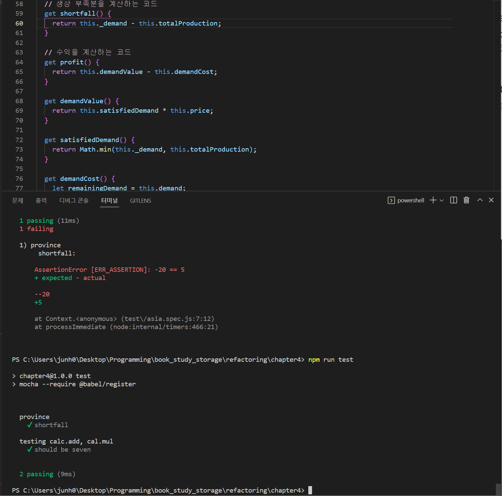
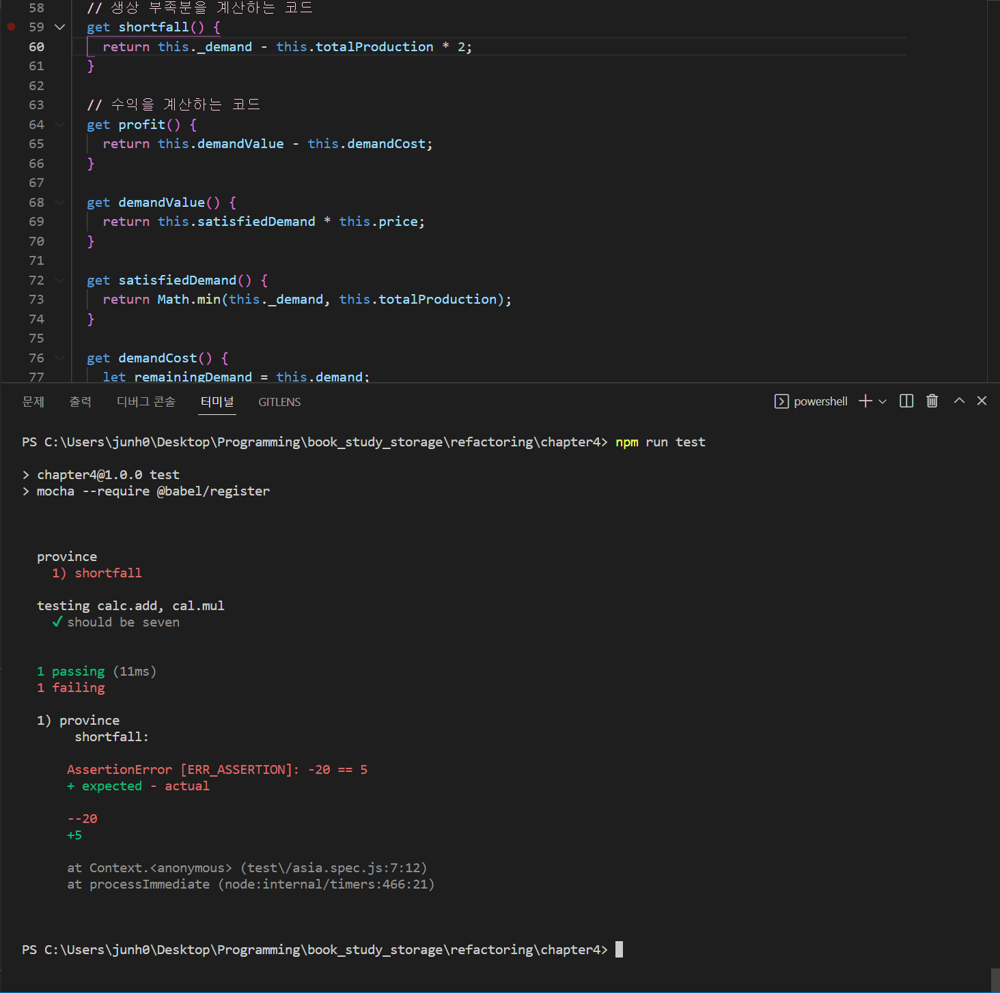
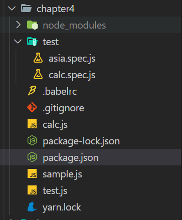

# 책 소개

**리팩터링, 마틴 파울러**


## 목차

- [1. 리팩터링 첫 번째 예시](#1-리팩터링-첫-번째-예시)
- [2. 리팩터링 원칙](#2-리팩터링-원칙)
- [3. 코드에서 나는 악취](#3-코드에서-나는-악취)
- [4. 테스트 구축하기](#4-테스트-구축하기)
- [6. 기본적인 리팩터링](#6-기본적인-리팩터링)
- [7. 캡슐화](#7-캡슐화)

## 1. 리팩터링 첫 번째 예시

p.26 예시 프로그램을 본 수감

설계가 나쁜 시스템은 수정하기 어렵다. 원하는 동작을 수행하도록 하기위해 수정해야 할 부분을 찾고, 기존 코드와 잘 맞물려 작동하게 할 방법을 강구하기가 어렵기 때문이다. 무엇을 수정할지 찾기 어렵다면 실수를 저질러서 버그가 생길 가능성도 높아진다.

수백 줄짜리 코드를 수정할 때면 먼저 프로그램의 작동 방식을 더 쉽게 파악할 수 있도록 코드를 여러 함수와 프로그램 요소로 재구성한다. 프로그램의 구조가 빈약하다면 대체로 구조부터 바로잡은 뒤에 기능을 수정하는 편이 작업하기가 훨씬 수월하다.

**프로그램이 새로운 기능을 추가하기에 편한 구조가 아니라면, 먼저 기능을 추가하기 쉬운 형태로 리팩터링하고 나서 원하는 기능을 추가한다.**

## 2. 리팩터링 원칙

### 2.1 리팩터링정의

- **소프트웨어의 겉보기 동작은 그대로 유지한 채, 코드를 이해하고 수정하기 쉽도록 내부 구조를 변경하는 기법**
- 명사 - 소프트웨어의 겉보기 동작은 그대로 유지한 채, 코드를 이해하고 수정하기 쉽도록 내부 구조를 변경하는 기법
- 동사 - 소프트웨어의 겉보기 동작은 그대로 유지한 채, 여러 가지 리팩터링 기법을 적용해서 소프트웨어를 재구성하다
- 지금껏 수많은 사람이 코드를 정리하는 작업을 모두 ‘리팩터링’이라고 표현하고 있는데, 특정한 방식에 따라 코드를 정리하는 것만이 리팩터링이다
- 누군가 “리팩터링하다가 코드가 깨져서 며칠이나 고생했다”라고 한다면, 십중팔구 리팩터링한 것이 아니다
- 한 번에 바꿀 수 있는 작업을 수많은 단계로 잘게 나눠서 작업하는 모습을 처음 접하면 리팩터링하는 것이 오히려 비효율적이라고 생각하기 쉽다. 하지만 이렇게 잘게 나눔으로써 오히려 작업을 더 빨리 처리할 수 있다
- 무엇보다 디버깅하는 데 시간을 뺏기지 않기 때문이다
- 리팩터링하기 전과 후의 코드가 똑같이 동작해야 한다. 사용자의 관점에서는 달라지는 점이 없어야 한다
- 리팩터링은 성능 최적화와 비슷하다. 둘 다 코드를 변경하지만 프로그램의 전반적인 기능은 그대로 유지한다. 단지 목적이 다를 뿐이다. 리팩터링의 목적은 코드를 이해하고 수정하기 쉽게 만드는 것이다. 반면 성능 최적화는 오로지 속도 개선에만 신경 쓴다. 그래서 목표 성능에 반드시 도달해야 한다면 코드는 다루기에 더 어렵게 바뀔 수도 있음을 각오해야 한다

### 2.2 두 개의 모자

- 소프트웨어를 개발할 때 목적이 ‘기능 추가’냐, 아니면 ‘리팩터링’이냐를 명확히 구분해 작업한다
- 켄트 벡은 이를 두 개의 모자에 비유했다.
- 기능을 추가할 때는 ‘기능 추가’모자를 쓴 다음 기존 코드는 절대 건드리지 않고 새 기능을 추가하기만 한다
- 리팩터링할 때는 ‘리팩터링’ 모자를 쓴 다음 기능 추가는 절대 하지 않기로 다짐한 뒤 오로지 코드 재구성에만 전념한다

### 2.3 리팩토링하는 이유

1. 소프트웨어 설계가 좋아진다

   - 리팩터링하지 않으면 소프트웨어 내부 설계(아키텍처)가 썩기 쉽다
   - 아키텍처를 충분히 이해하지 못한 채 단기 목표만을 위해 코드를 수정하다 보면 기반 구조가 무너지기 쉽다. 그렇다면 코드만 봐서는 설계를 파악하기 어려워진다
   - 코드 구조가 무너지기 시작하면 악효과가 누적된다
   - 같은 일을 하더라도 설계까 나쁘면 코드가 길어지기 십상이다
   - 중복 코드를 제거하면 모든 코드가 언제나 고유한 일을 수행함을 보장할 수 있으며, 이는 바람직한 설계의 핵심이다

2. 소프트웨어를 이해하기 쉬워진다

   - 컴퓨터에게 시키려는 일과 이를 표현한 코드의 차이를 최대한 줄여야 한다
   - 프로그래밍은 결국 내가 원하는 바를 정확히 표현하는 일이다
   - 리팩터링은 코드가 더 잘 읽히게 도와준다
   - 단지 다른 사람을 배려하기 위해서가 아니다. 사실 그 다른 사람이 바로 나 자신일 때가 많다
   - 기억할 필요가 있는 것은 최대한 코드에 담으려고 한다(코드 자체만 보고 파악할 수 있도록 만드는 것이 제일 좋다)

3. 버그를 쉽게 찾을 수 있따

   - 코드를 이해하기 쉽다는 말은 버그를 찾기 쉽다는 말이기도 하다
   - 리팩터링하면 코드가 하는 일을 깊이 파악하게 되면서 새로 깨달은 것을 곧바로 코드에 반영하게 된다

4. 프로그래밍 속도를 높일 수 있다

   - 한 시스템을 오래 개발 중인 개발자들과 얘기하다 보면 초기에는 진척이 빨랐지만 현재는 새 기능을 하나 추가하는데 훨씬 오래 걸린다는 말을 많이 한다
   - 새로운 기능을 추가할수록 기존 코드베이스에 잘 녹여낼 방법을 찾는 데 드는 시간이 늘어난다는 것이다
   - 설령 프로그램 요구사항이 바뀌더라도 설계를 지속해서 개선할 수 있다
   - 그래서 빠른 개발이라는 숭고한 목표를 달성하려면 리팩터링이 반드시 필요하다

### 2.4 언제 리팩토링 해야 하나?

1. 프로젝트 시작단계

   - 좋은 디자인 패턴으로 코드를 깔끔하게 작성
   - 기능 구현을 위한 코드를 작성
   - 테스트 코드를 작성 (테스트 코드를 동작하게 하기 위한 리팩토링)
   - **3의 법칙: 비슷한 일을 세 번쨰 하게 되면 리팩토링한다**
   - 코드를 이해하기 쉽게 만들기 > 좋은 문서화
   - 기능을 쉽게 추가하게 만들기 > 재사용성, 모듈성을 높일 수 있음

2. 프로젝트 유지보수 단계

   - 버그름 검증할 수 있는 테스트 코드
   - 코드를 이해하기 쉽게, 변경하기 쉽게 변경 (리팩토링)

3. 오래된(레거시) 프로젝트

   - (버그 수정 및 기능추가시에만) 수정이 필요한 모듈/코드 한정적으로 테스트 추가
   - 리팩토링을 통해 코드 수정 또는 기능을 추가
   - 때로는 새로운 코드를 작성하는 것이 빠를 수 있으므로 우선순위에 따라 전략을 다르게 가져가야 한다

### 2.5 리팩토링 시 고려할 문제

- “무결점 클린코드, 완벽한 설계는 존재하지 않는다”를 인정해야 한다
- 상황에 맞게 좋은 디자인 패턴으로 코드를 깔끔하게 작성하면 된다
- 먼저 기능 구현을 위한 코드를 작성한 이후 테스트 코드를 작성하며 리팩토링을 해나간다.

### 2.6 리팩터링, 아키텍처, 애그니

- 애**그니**: **Y**ou **A**in’t **G**onna **N**eed **I**t
- 당장 필요하지 않는 기능에 집착해서 코드를 지나치게 복잡하게 만들 필요가 없다
- 사용하지 않는 기능을 우선적으로 만들 필요가 없다
- 지나치게 미래지향적인 코드를 작성할 필요가 없다

### 2.7 리팩터링과 소프트웨어 개발 프로세스

- 자가 테스트 코드와 리팩터링을 묶어서 테스트 주도 개발(TDD)이라 한다
- 리팩터링의 첫 번째 토대는 자가 테스트 코드다
- 프로그래밍 도중 발생한 오류를 확실히 걸러내는 테스트를 자동으로 수행할 수 있어야 한다
- 지속적 통합을 적용하면 팀원 각자가 수행한 리팩터링 결과를 빠르게 동료와 공유할 수 있다
- 자가 테스트 코드, 지속적 통합, 리팩터링이라는 세 기법은 서로 강력한 상승효과를 발휘한다
- 리팩터링과 YAGNI는 서로 긍정적인 영향을 준다. 리팩터링이 YAGNI의 토대인 동시에, YAGNI로 인해 리팩터링을 더욱 쉽게 할 수 있다

### 2.8 리팩터링과 성능

- ‘직관적인 설계 vs 성능’은 중요한 주제다
- 리팩터링하면 소프트웨어가 느려질 수 있는 건 사실이다. 하지만 그와 동시에 성능을 튜닝하기는 더 쉬워진다
- 먼저 튜닝하기 쉽게 만들고 나서 원하는 속도가 나게끔 튜닝하는 것이다
- 성능 최적화 단계가 되면 다음의 구체적인 절차를 따라 프로그램을 튜닝한다

  - 먼저 프로파일러로 프로그램을 분석하여 시간과 공간을 많이 잡아먹는 지점을 알아낸다
  - 그런 다음 전체를 고르게 최적화할 떄와 마찬가지 방법으로 그 부분들을 개선한다
  - 각 단계마다 컴파일과 테스트를 거치고 프로파일러를 다시 실행해본다
  - 성능이 개선되지 않았다면 수정 내용을 되돌린다

## 3. 코드에서 나는 악취

- 이제 리팩터링이 어떻게 작동하는지 감이 왔을 것이다. 하지만 ‘적용 방법’을 아는 것과 ‘제때 적용’할 줄 아는 것은 다르다
- 리팩터링을 언제 시작하고 언제 그만할지를 판단하는 일은 리팩터링의 작동 원리를 아는 것 못지 않게 중요하다
- 리팩터링을 ‘언제’ 해야 하는지에 대해서는 명확하게 정립된 규칙이 없다
- 이번 장에서 리팩터링할 ‘시점’을 설명하는데 ‘냄새’라는 표현을 사용했다
- 하지만 리팩터링을 언제 멈춰야 하는지를 판단하는 정확한 기준을 제시하지는 않을 것이다. 숙련된 사람의 직관만큼 정확한 기준은 없기 때문이다

### 3.1 기이한 이름

- 코드를 명료하게 표현하는 데 가장 중요한 요소 하나는 바로 ‘이름’이다
- 그래서 함수, 모듈, 변수, 클래스 등은 그 이름만 보고도 각각이 무슨 일을 하고 어떻게 사용해야 하는지 명확히 알 수 있도록 엄청나게 신경 써서 이름 지어야 한다
- 이름 바꾸기는 단순히 이름을 다르게 표현하는 연습이 아니다. 마땅한 이름이 떠오르지 않는다면 설계에 더 근본적인 문제가 숨어 있을 가능성이 높다
- 그래서 혼란스러운 이름을 잘 정리하다 보면 코드가 훨씬 간결해질 때가 많다

- **함수 선언 바꾸기**
- **변수 이름 바꾸기**
- **필드 이름 바꾸기**

### 3.2 중복 코드

- 똑같은 코드 구조가 여러 곳에서 반복된다면 하나로 통합하여 더 나은 프로그램을 만들 수 있다

- **함수 추출하기**
- **문장 슬라이드하기**
- **메서드 올리기**

### 3.3 긴 함수

- 오랜 기간 잘 활용되는 프로그램들은 하나같이 짧은 함수로 구성됐다. 얼핏 훑으면 연산하는 부분이 하나도 없어 보인다. 코드가 끝없이 위임하는 방식으로 작성되어 있기 때문이다
- 간접 호출의 효과, 즉 **코드를 이해하고, 공유하고, 선택하기 쉬워진다는 장점은 함수를 짧게 구성할 때 나오는 것이다**
- 짧은 함수로 구성된 코드를 이해하기 쉽게 만드는 가장 확실한 방법은 좋은 이름이다. 함수 이름을 잘 지어두면 본문 코드를 볼 이유가 사라진다
- 적극적으로 함수를 쪼개야 한다. 함수 이름은 동장 방식이 아닌 **‘의도’**가 드러나게 짓는다
- 원래 코드보다 길어지더라도 함수로 뽑는다. ‘무엇을 하는지’를 코드가 잘 설명해주지 못할 수록 함수로 만드는 게 유리하다

- 함수 추출하기
- 임시 변수를 질의 함수로 바꾸기
- 매개변수 객체 만들기
- 객체 통째로 넘기기
- 함수를 명령으로 바꾸기
- 조건문 분해하기
- 함수 추출하기
- 조건부 로직을 다형성으로 바꾸기
- 반복문 쪼개기

### 3.4 긴 매개변수 목록

- 매개변수 목록이 길어지면 그 자체로 이해하기 어려울 때가 많다

- 매개변수를 질의 함수로 바꾸기
- 객체 통째로 넘기기
- 매개변수 객체 만들기
- 플래그 인수 제거하기
- 여러 함수를 클래스로 묶기

### 3.5 전역 데이터

- 전역 데이터를 주의해야 한다는 말은 우리가 소프트웨어 개발을 시작한 초창기부터 귀가 따갑게 들었다. 우리가 겪을 수 있는 악취 중 가장 지독한 축에 속한다

- 변수 캡슐화하기

### 3.6 가변 데이터

- 변경하려는 값에 해당하는 복사본을 만들어서 반환하기

- 변수 캡슐화하기
- 변수 쪼개기
- 문장 슬라이드하기
- 함수 추출하기
- 질의 함수와 변경 함수 분리하기
- 세터 제거하기
- 파생 변수를 질의 함수로 바꾸기
- 여러 함수를 클래스로 묶기
- 여러 함수를 변환 함수로 묶기
- 참조를 값으로 바꾸기

### 3.7 뒤엉킨 변경

- 코드를 수정할 때는 시스템에서 고쳐야 할 딱 한 군데를 찾아서 그 부분만 수정할 수 있기를 바란다
- 이렇게 할 수 없다면 뒤엉킨 변경과 산탄총 수술 중하나가 풍긴다
- 뒤엉킨 변경은 단일 책임 원칙(Single Responsibility Principle) 이 제대로 지켜지지 않을 때 나타난다. 하나의 모듈이 서로 다른 이유들로 인해 여러 가지 방식으로 변경되는 일이 많을 때 발생한다
- 지원해야 할 데이터베이스가 추가될 때마다 함수 세 개를 바꿔야 한다면 ㅁ뒤엉킨 변경이 발생했다는 뜻이다

- 단계 쪼개기
- 함수 옮기기
- 함수 추출하기
- 클래스 추출하기

### 3.8 산탄총 수술

- 이 냄새는 코드를 변경할 때마다 자잘하게 수정해야 하는 클래스가 많을 때 풍긴다
- 변경할 부분이 코드 전반에 퍼져있다면 찾기도 어렵고 꼭 수정해야 할 곳을 지나치기 쉽다

- 함수 옮기기
- 필드 옮기기
- 여러 함수를 클래스로 묶기
- 여러 함수를 변환 함수로 묶기
- 단계 쪼개기
- 함수 인라인하기
- 클래스 인라인하기

### 3.9 기능 편애

- 프로그램을 모듈화할 때는 코드를 여러 영역**(스코프)**으로 나눈 뒤 영역**(스코프)** 안에서 이뤄지는 상호작용은 최대한 늘리고 영역 **(스코프)**사이에서 이뤄지는 상호작용은 최소로 줄이는 데 주력한다
- 기능 편애는 **흔히 어떤 함수가 자기가 속한 모듈의 함수나 데이터보다 다른 모듈의 함수나 데이터와 상호작용 할 일이 더많을 때 풍기는 냄새다**
- 실행 과정에서 외부 객체의 게터 메서드 대여섯 개를 호출하는 함수가 기능 편애 함수에 해당한다

- 함수 옮기기
- 함수 추출하기

### 3.10 데이터 뭉치

- 데이터 항목들은 어린아이 같은 면이 있다. 어울려 노는 걸 좋아한다
- 데이터 항목 서너 개가 여러 곳에서 항상 함께 뭉쳐다니는 모습을 목격할 수 있다
- 객체를 통째로 넘겨 매개변수의 개수를 줄일 수 있다

- 클래스 추출하기
- 매개변수 객체 만들기
- 객체 통째로 넘기기

### 3.11 기본형 집착

- 프로그래머 중에서는 자신에게 주어진 문제에 딱 맞는 기초 타입(화폐, 좌표, 구간 등)을 직접 정의하기 꺼리는 사람이 많다. 그래서 숫자형으로 계산하거나, 단위를 무시하고 처리하는 코드를 수없이 봤다
- 전화 번호를 단순히 문자 집합으로만 표현하기에는 아쉬움이 많다. 최소한 사용자에게 보여줄 때는 일관된 형식으로 출력해주는 기능이라도 갖춰야 한다

- 기본형을 객체로 바꾸기
- 타입 코드를 서브클래스로 바꾸기
- 조건부 로직을 다형성으로 바꾸기
- 클래스 추출하기
- 매개변수 객체 만들기

### 3.12 반복되는 switch문

- 이 책으 초판에는 “switch문”이란 냄새를 소개하기도 했는데, 사람들이 다형성을 이용하도록 전환시키는 데 도움이 되었기 때문이다
- 단순히 switch문을 썼다고 해서 자동으로 검토 대상은 되지 않는 세상이 되었다
- 그러니 이제는 똑같은 조건부 로직(switch/case문이나 길게 나열된 if/else문)이 여러 곳에서 반복해 등장하는 코드에 집중해보자

- 조건부 로직을 다형성으로 바꾸기

### 3.13 반복문

- 반복문을 파이프라인으로 바꾸기

### 3.14 성의 없는 요소

- 우리는 코드의 구조를 잡을 때 프로그램 요소(프로그래밍 언어가 제공하는 함수, 클래스, 인터페이스 등 코드 구조를 잡는 데 활용되는 요소)를 이용하는 것을 좋아한다. 그래야 그 구조를 변형하거나 재활용할 기회가 생기고, 혹은 단순히 더 의미 있는 이름을 가졌기 때문이다
- 하지만 이런 구조는 나중에 본문을 더 채우거나 다른 메서드를 추가할 생각이었지만, 어떠한 사정으로 인해 그렇게 하지 못한 결과일 수 있다. 혹은 원래는 풍성했던 클래스가 리팩터링을 거치면서 역할이 줄어들었을 수 있다

- 함수 인라인하기
- 클래스 인라인하기
- 계층 합치기

### 3.15 추측성 일반화

- 추측성 일반화는 **‘나중에 필요할 거야’라는 생각으로 당장은 필요 없는 모든 종류의 후킹 포인트와 특이 케이스 처리를 로직으로 작성해둔 코드에서 풍기는 냄새**이다
- 미랠를 대비해 작성한 부분을 실제로 사용하게 되면 다행이지만, 그렇지 않는다면 쓸데없는 낭비일 뿐이다

- 계층 합치기
- 함수 인라인하기
- 클래스 인라인하기
- 함수 선언 바꾸기

### 3.16 임시 필드

### 3.17 메시지 체인

### 3.18 중개자

- 객체의 대표적인 기능 하나로, 외부로부터 세부사항을 숨겨주는 캡슐화가 있다
- 캡슐화하는 과정에서는 위임이 자주 활용된다
- 하지만 지나치면 문제가 된다. 클래스가 제공하는 메서드 중 절반이 다른 클래스에 구현을 위임하고 있다면 어떤가? 이럴 때는 **중개자 제거하기**를 활용하여 실제로 일을 하는 객체와 직접 소통하게 하자

### 3.19 내부자 거래

### 3.20 거대한 클래스

### 3.21 서로 다른 인터페이스의 대안 클래스들

### 3.22 데이터 클래스

### 3.23 상속 포기

### 3.24 주석

- 주석을 달면 안 된다고 말하려는 건 아니니 걱정하지 말자
- 주석은 악취가 아닌 향기를 입힌다. 문제는 주석을 탈취제처럼 사용하는 데 있다
- 주석이 장황하게 달린 원인이 코드를 잘못 작성했기 때문인 경우가 의외로 많다
- 주석이 많으면 이 장에서 소개한 온갖 악취를 풍기는 코드가 나오기 쉽다
- 특정 코드 블록이 하는 일에 주석을 남기고 싶다면 **함수 추출하기**를 적용해 본다
- 이미 추출되어 있는 함수임에도 여전히 설명이 필요하다면 **함수 선언 바꾸기**로 함수 이름을 바꿔본다
- 주석을 남겨야 겠다는 생각이 들면, 가장 먼저 주석이 필요없는 코드로 리팩터링해본다

## 4. 테스트 구축하기

리팩터링을 제대로 하려면 **불가피하게 저지르는 실수를 잡아주는 견고한 테스트 스위트(test suite)가 뒷받침돼야 한다**. 자동 리팩터링 도구를 활용하더라도 이 책에서 소개하는 리팩터링 중 다수는 테스트 스위트로 재차 검증할 것이다

### 4.1 자가 테스트 코드의 가치

- 프로그래머들이 어떻게 일하는지 살펴보면 실제로 코드를 작성하는 시간의 비중은 그리 크지 않음을 알 수 있다. 현재 상황을 파악하기도 하고, 설계를 고민하기도 한다. 물론 대부분의 시간은 디버깅에 쓴다
- 버그 수정 자체는 대체로 금방 끝난다. 진짜 끔직한 건 버그를 찾는 여정이다. 또한 버그를 잡는 과정에서 다른 버그를 심기도 하는데, 그 사실을 한참이 지나서야 알아채기도 한다
- 모든 테스트를 완전히 자동화하고 그 결과까지 스스로 검사하게 만들자
- 테스트를 작성하기 가장 좋은 시점은 프로그래밍을 시작하기 전이다. 나는 기능을 추가해야 할 때 테스트부터 작성한다. 얼핏 순서가 뒤바뀐 듯 들리지만, 전혀 그렇지 않다. 테스트를 작성하다 보면 원하는 기능을 추가하기 위해 무엇이 필요한지 고민하게 된다. 구현보다 인터페이스에 집중하게 된다는 장점도 있다. 게다가 코딩이 완료되는 시점을 정확하게 판단할 수 있다. 테스트를 모두 통과한 시점이 바로 코드를 완성한 시점이다
- 이처럼 테스트부터 작성하는 습관을 바탕으로 테스트 주도 개발(TDD, Test-Driven Development)이란 기법이 창시됐다. TDD에서는 (처음에는 통과하지 못할) 테스트를 작성하고, 이 테스트를 통과하게끔 코드를 작성하고, 결과 코드를 최대한 깔끔하게 리팩터링하는 과정을 짧은 주기로 반복한다
- 자바스크립트 프로그램용으로 테스트 코드를 작성하는 방법을 소개한다. 코드를 테스트하기 위해서는 테스트 프레임워크를 마련해야 한다. 여기서는 현재 널리 쓰이고 나름 좋다고 알려진 [모카](https://mochajs.org/) (Mocha)를 사용한다

### Mocha Test 시에 import, export 사용하기

- [https://stackoverflow.com/questions/60227314/how-to-test-es6-modules-these-with-import-with-mocha/69386358#69386358](https://stackoverflow.com/questions/60227314/how-to-test-es6-modules-these-with-import-with-mocha/69386358#69386358)
  ### 개요
  ### 1. babel 관련 패키지 설치
  ```
  yarn add @babel/cli @babel/core @babel/preset-env @babel/register --dev
  ```
  - @babel/cli : [링크](https://babeljs.io/docs/en/babel-cli)
    - 명령줄에서 파일을 컴파일하는 데 사용할 수 있는 CLI
  - @babel/core : [링크](https://babeljs.io/docs/en/babel-core)
    - babel에서 사용하는 core lib입니다
  - @babel/preset-env : [링크](https://babeljs.io/docs/en/babel-preset-env)
    - 환경에 필요한 구문 변환을 우리가 관리할 필요 없이 최신 JS를 사용할 수 있게 해줍니다.
  ### babel 구성
  - .babelrc를 프로젝트 root 위치에 생성 후 아래 내용을 추가해주세요
  ```
  {
  	"presets" : ["@babel/preset-env"]
  }
  ```
  ### package.json
  - package.json의 스크립트에서 mocha에 --require 옵션을 통해 해당 모듈을 사용한다고 적어줍니다
  ```json
  {
    "name": "chapter4",
    "version": "1.0.0",
    "description": "",
    "main": "asia.js",
    "scripts": {
      "test": "mocha --require @babel/register",
      "test_recursive": "mocha --recursive --require @babel/register './test/**/*.js'"
    },
    "author": "junhee lee",
    "license": "ISC",
    "devDependencies": {
      "@babel/cli": "^7.18.6",
      "@babel/core": "^7.18.6",
      "@babel/preset-env": "^7.18.6",
      "@babel/register": "^7.18.6",
      "chai": "^4.3.6",
      "mocha": "^10.0.0"
    }
  }
  ```

<details>

<summary>성공</summary>


</details>

<details>

<summary>실패</summary>


</details>

<details>

<summary>전체 테스트 코드</summary>

폴더 구조에 따라 상대경로로 달라질 수 있기 때문에, 제가 구성한 폴더 구조를 첨부해두겠습니다

- 나의 폴더 구조



```jsx
const { expect } = require("chai");
const { Province, sampleProvinceData } = require("../sample");

describe("province", function () {
  let asia;
  this.beforeEach(function () {
    asia = new Province(sampleProvinceData());
  });
  it("shortfall", function () {
    // expect(asia.shortfall, 5);
    expect(asia.shortfall).equal(5);
  });

  it("profit", function () {
    expect(asia.profit).equal(230);
  });

  it("change production", function () {
    asia.producers[0].production = 20;
    expect(asia.shortfall).equal(-6);
    expect(asia.profit).equal(292);
  });

  it("zero demand", function () {
    // 수요가 없다
    asia.demand = 0;
    expect(asia.shortfall).equal(-25);
    expect(asia.profit).equal(0);
  });

  it("negative demand", () => {
    // 수요가 마이너스
    asia.demand = -1;
    expect(asia.shortfall).equal(-26);
    expect(asia.profit).equal(-10);
  });

  it("empty string demand", () => {
    // 수요 입력란이 비어있을 때 - UI 로부터 문자열을 취하고 있을 때, 필드가 비어 있을 수 있음
    asia.demand = "";
    expect(asia.shortfall).NaN;
    expect(asia.profit).NaN;
  });
});

describe("no producers", function () {
  // 생산자가 없다.
  let noProducers;
  this.beforeEach(function () {
    const data = {
      name: "No producers",
      producers: [],
      demand: 30,
      price: 20,
    };
    noProducers = new Province(data);
  });

  it("shortfall", function () {
    expect(noProducers.shortfall).equal(30);
  });

  it("profit", function () {
    expect(noProducers.profit).equal(0);
  });
});

describe("string for producers", () => {
  it("", () => {
    const data = {
      name: "String producers",
      producers: "",
      demand: 30,
      price: 20,
    };
    const prov = new Province(data);
    expect(prov.shortfall).equal(0);
  });
});
```

</details>

### 4.3 첫 번째 테스트

<details>
<summary>테스트할 샘플 코드</summary>

```jsx
function sampleProvinceData() {
  return {
    name: "Asia",
    producers: [
      { name: "Byzantium", cost: 10, production: 9 },
      { name: "Attalia", cost: 12, production: 10 },
      { name: "Sinope", cost: 10, production: 6 },
    ],
    demand: 30,
    price: 20,
  };
}

/**
 * 지역 전체를 나타내는 클래스
 * 다양한 데이터에 대한 접근자들이 담겨 있다
 * */
class Province {
  constructor(doc) {
    this._name = doc.name;
    this._producers = [];
    this._totalProduction = 0;
    this._demand = doc.demand;
    this._price = doc.price;
    doc.producers.forEach((d) => this.addProducer(new Producer(this, d)));
  }

  addProducer(arg) {
    this._producers.push(arg);
    this._totalProduction += arg.production;
  }

  get name() {
    return this._name;
  }
  get producers() {
    return this._producers.slice();
  }
  get totalProduction() {
    return this._totalProduction;
  }
  set totalProduction(arg) {
    this._totalProduction = arg;
  }
  get demand() {
    return this._demand;
  }
  set demand(arg) {
    this._demand = parseInt(arg);
  } // 숫자로 파싱해 저장
  get price() {
    return this._price;
  }
  set price(arg) {
    this._price = parseInt(arg);
  } // 숫자로 파싱해 저장

  // 생상 부족분을 계산하는 코드
  get shortfall() {
    return this._demand - this.totalProduction;
  }

  // 수익을 계산하는 코드
  get profit() {
    return this.demandValue - this.demandCost;
  }

  get demandValue() {
    return this.satisfiedDemand * this.price;
  }

  get satisfiedDemand() {
    return Math.min(this._demand, this.totalProduction);
  }

  get demandCost() {
    let remainingDemand = this.demand;
    let result = 0;
    this.producers
      .sort((a, b) => a.cost - b.cost)
      .forEach((p) => {
        const contribution = Math.min(remainingDemand, p.production);
        remainingDemand -= contribution;
        result += contribution * p.cost;
      });
    return result;
  }
}

/**
 * 생산자를 나타내는 클래스
 * 단순한 데이터 저장소로 쓰인다
 *   */
class Producer {
  constructor(aProvince, data) {
    this._province = aProvince;
    this._cost = data.cost;
    this._name = data.name;
    this._production = data.production || 0;
  }

  get name() {
    return this._name;
  }

  get cost() {
    return this._cost;
  }

  set cost(arg) {
    this._cost = parseInt(arg);
  }

  get production() {
    return this._production;
  }

  set production(amountStr) {
    const amount = parseInt(amountStr);
    const newProduction = Number.isNaN(amount) ? 0 : amount;
    this._province.totalProduction += newProduction - this._production;
    this._production = newProduction;
  }
}

module.exports = {
  sampleProvinceData,
  Province,
};
```

</details>

```jsx
describe("province", function () {
  it("shortfall", function () {
    const asia = new Province(sampleProvinceData()); // 1. 픽스처 설정
    assert.equal(asia.shortfall, 5); // 2. 검증
  });
});
```

- 첫 번째 단계에서는 테스트에 필요한 데이터와 객체를 뜻하는 픽스처(고정장치)를 설정한다
- 두 번째 단계에서는 이 픽스쳐의 속성들을 검증하는데, 여기서는 주어진 초깃값에 기초하여 생산 부족분을 정확히 계산했는지 확인한다

- 실패해야 할 상황에서는 반드시 실패하게 만들자

```jsx
get shortfall(){
	return this._demand - this.totalProduction * 2; // 오류 주입
}
```

- 수정 후 테스트를 다시 실행하면 에러가 발생한다
- 모카 프레임워크는 소위 어서션(assertion: 단언, 확언) 라이브러리라고 하는 픽스처 검증 라이브러리를 선택해 사용할 수 있다. 현재 자바스크립트용 어서션 라이브러리는 엄청나게 많다. 이 책에서는 차이(Chai) 라이브러리를 사용했다
- 위에 적은 전체 테스트 코드에서 차이 라이브러리를 통해 esm 에서 어떻게 사용했는지 살펴보고 적용해보자!

### 4.5 픽스처 수정하기

- 테스트에 관해 공부했다면 지금 테스트가 어떻게 돌아가고 있는지 예측이 가능할 것이다
- 우리가 ‘**설정**’한 표준 픽스처를 취해서, 테스트를 ‘**수행**’하고, 이 픽스처가 일을 기대한 대로 처리했는지를 ‘**검증**’한다
- 이를 설정-실행-검증 / 조건-발생-결과 / 준비-수행-단언 등으로 부른다

### 4.6 경계 조건 검사하기

- 지금까지 작성한 테스트는 모든 일이 순조롭고 사용자도 의도대로 사용하는 일명, ‘꽃길’ 상황에 집중하였다
- 하지만 이 범위를 벗어나는 경계 지점에서 문제가 생기면 어떤 일이 벌어지는지 확인하는 테스트도 함께 작성하면 좋다 (컬렉션이 비어있거나, 음수일 때 등을 판단하는 것을 말한다)

```jsx
describe("no producers", function () {
  // 생산자가 없다.
  let noProducers;
  this.beforeEach(function () {
    const data = {
      name: "No producers",
      producers: [],
      demand: 30,
      price: 20,
    };
    noProducers = new Province(data);
  });

  it("shortfall", function () {
    expect(noProducers.shortfall).equal(30);
  });

  it("profit", function () {
    expect(noProducers.profit).equal(0);
  });
});

describe("string for producers", () => {
  it("", () => {
    const data = {
      name: "String producers",
      producers: "",
      demand: 30,
      price: 20,
    };
    const prov = new Province(data);
    expect(prov.shortfall).equal(0);
  });
});
```

- 여기서 한 가지 의문이 들 수 있다. 수요가 음수일 때 수익이 음수가 나온다는 것이 이 프로그램을 사용하는 고객 관점에서 말이 되지 않기 때문이다
- 문제가 생길 가능성이 있는 경계 조건을 생각해보고 그 부분을 집중적으로 테스트하자
- 모든 버그를 잡아낼 수 없다고 생각하여 테스트를 작성하지 않는다면 대다수의 버그를 잡을 수 있는 기회를 날리는 셈이다
- 그렇다면 테스트를 어느 수준까지 해야 할까? 테스트는 위험한 부분에 집중하는 것이 좋다
- 코드에서 처리 과정이 복잡한 부분을 찾아보자. 함수에서 오류가 생길만한 부분을 찾아보자. 테스트가 모든 버그를 걸러주지는 못할지라도, 안심하고 리팩터링할 수 있는 보호막은 되어준다. 리팩터링을 하면서 프로그램을 더욱 깊게 이해하게 되어 더 많은 버그를 찾게 된다
- 필자는 항상 테스트 스위트부터 갖춘 뒤에 리팩터링하지만, 리팩터링하는 동안에도 계속해서 테스트를 추가한다

### 4.7 끝나지 않은 여정

- **테스트는 매우 중요하다. 리팩터링에 반드시 필요한 토대일 뿐 만 아니라, 그 자체로도 프로그래밍에 중요한 역할을 한다**
- 이 장에서 보여준 테스트는 단위 테스트(unit test)에 해당한다. 단위 테스트란 코드의 작은 영역만을 대상으로 빠르게 실행되도록 설계된 테스트다. **단위 테스트는 자가 테스트 코드의 핵심이자, 자가 테스트 시스템은 대부분 단위 테스트가 차지한다**

## 6. 기본적인 리팩터링

- 가장 많이 사용하는 리팩터링은 **함수 추출하기**와 **변수 추출하기**다
- 리팩터링은 본래 코드를 변경하는 작업인 만큼, 이 두 리팩터링을 반대로 진행하는 **함수 인라인하기**와 **변수 인라인하기**도 자주 사용한다
- **함수 선언 바꾸기**는 함수의 이름을 변경할 때 많이 쓰인다
- 바꿀 대상이 변수라면 **변수 이름 바꾸기**를 사용하는데, 이는 **변수 캡슐화하기**와 관련이 깊다
- 자주 함께 뭉쳐 다니는 인수들은 **매개변수 객체 만들기**를 적용해 객체 하나로 묶으면 편리할 때 가 많다

- 함수 구성과 이름 짓기는 가장 기본적인 저수준 리팩터링이다. 그런데 일단 함수를 만들고 나면 다시 고수준 모듈로 묶어야 한다
- 이렇게 함수를 그룹으로 묶을 때는 **여러 함수를 클래스**로 묶기를 이용한다
- 또 다른 방법으로 **여러 함수를 변환 함수로 묶기**도 있는데, 읽기전용 데이터를 다룰 때 특히 좋다
- 한 걸음 더 나아가, 한데 묶은 모듈들의 작업 처리 과정을 명확한 단계로 구분 짓는 **단계 쪼개기**를 적용할 때도 많다

### 6.1 함수 추출하기

**배경**

코드를 언제 독립된 함수로 묶어야 할지에 관한 의견은 수없이 많다. 먼저 길이를 기준으로 삼을 수 있다. 가령 함수 하나가 한 화면을 넘어가면 안 된다는 규칙을 떠올릴 수 있다. 재사용성을 기준으로 할 수도 있다. 두 번 이상 사용될 코드는 함수로 만들고, 한 번만 쓰이는 코드는 인라인 상태로 놔두는 것이다.

하지만 내눈에는 '목적의 구현을 분리'하는 방식이 가장 합리적인 기준으로 보인다. 코드를 보고 무슨 일을 하는지 파악하는데 한참이 걸린다면 그 부분을 함수로 추출한 뒤 '무슨 일'에 걸맞는 이름을 짓는다. 이렇게 해두면 나중에 코드를 다시 읽을 때 함수의 목적이 눈에 확 들어오고, 본문 코드에 대해서는 더 이상 신경 쓸 일이 거의 없다.

함수를 짧게 만들면 함수 호출이 많아져서 성능이 느려질까 걱정하는 사람들도 있다. 필자가 젊던 시절에는 간혹 문제가 되긴 했지만 요즘은 그럴 일이 거의 없다. 함수가 짧으면 캐싱하기가 더 쉽기 때문에 컴파일러가 최적화하는 데 유리할 때가 많다. 성능 최적화에 대해서는 항상 일반 지침을 따르도록 하자

```
"최적화 할 때는 다음 두 규칙을 따르기 바란다."
"첫 번째, 하지 마라."
"두 번째(전문가 한정), 아직 하지 마라"
```

**절차**

1. 함수를 새로 만들고 목적을 잘 드러내는 이름을 붙인다('어떻게'가 아닌 '무엇을'하는지가 드러나야 한다)
2. 추출할 코드를 원본 함수에서 복사하여 새 함수에 붙여넣는다
3. 추출한 코드 중 원본 함수의 지역 변수를 참조하거나 추출한 함수의 유효범위를 벗어나는 변수는 없는지 검사한다. 있다면 매개변수로 전달한다
4. 변수를 다 처리했다면 컴파일한다
5. 원본 함수에서 추출한 코드 부분을 새로 만든 함수를 호출하는 문장으로 바꾼다
6. 테스트한다
7. 다른 코드에 방금 추출한 것과 똑같거나 비슷한 코드가 없는지 살핀다. 있다면 방금 추출한 새 함수를 호출하도록 바꿀지 검토한다

<details>
<summary>리팩터링 전 코드</summary>

```js
export function printOwing(invoice) {
  let outstanding = 0;

  console.log("***********************");
  console.log("**** Customer Owes ****");
  console.log("***********************");

  // calculate outstanding
  for (const o of invoice.orders) {
    outstanding += o.amount;
  }

  // record due date
  const today = new Date();
  invoice.dueDate = new Date(
    today.getFullYear(),
    today.getMonth(),
    today.getDate() + 30
  );

  //print details
  console.log(`name: ${invoice.customer}`);
  console.log(`amount: ${outstanding}`);
  console.log(`due: ${invoice.dueDate.toLocaleDateString()}`);
}

const invoice = {
  orders: [{ amount: 2 }, { amount: 5 }],
  customer: "준희",
};
printOwing(invoice);
```

</details>

<details>
<summary>리팩터링 이후 코드</summary>

```js
function printOwing(invoice) {
  printBanner();
  let outstanding = calculateOutstanding(invoice);
  recordDueDate(invoice);
  printDetails(invoice, outstanding);
}

function printBanner() {
  console.log("***********************");
  console.log("**** 고객 채무 ****");
  console.log("***********************");
}

function calculateOutstanding(invoice) {
  return invoice.orders.reduce((sum, order) => (sum += order.amount), 0);
}

function recordDueDate(invoice) {
  const today = new Date();
  invoice.dueDate = new Date(
    today.getFullYear(),
    today.getMonth(),
    today.getDate() + 30
  );
}

function printDetails(invoice, outstanding) {
  console.log(`name: ${invoice.customer}`);
  console.log(`amount: ${outstanding}`);
  console.log(`due: ${invoice.dueDate.toLocaleDateString()}`);
}

const invoice = {
  orders: [{ amount: 2 }, { amount: 5 }],
  customer: "준희",
};
printOwing(invoice);

/**
 * 함수 내부 로직이 너무 길어서 이해하기 위한 비용이 많이 든다
 *
 * 지역 변수는 사용하는 곳과 최대한 가까이 놓기
 */
```

</details>

### 6.2 함수 인라인하기

**배경**

이 책은 목적이 드러나는 이름의 짤막한 함수를 이용하기를 권한다. 그래야 코드가 명료해지고 이해하기 쉬워지기 때문이다. 하지만 때로는 함수 본문이 이름만큼 명확한 경우도 있다. 또는 함수 본문 코드를 이름만큼 깔끔하게 리팩터링할 때도 있다. 이럴 때는 그 함수를 제거한다. 간접 호출은 유용할 수도 있지만 쓸데없는 간접 호출은 거슬릴 뿐이다.

**절차**

1. 다형 메서드인지 확인한다
2. 인라인할 함수를 호출하는 곳을 모두 찾는다
3. 각 호출문을 함수 본문으로 교체한다
4. 하나씩 교체할 때마다 테스트한다
5. 함수 정의(원래 함수)를 삭제한다

<details>
<summary>리팩터링 전 코드</summary>

```js
function rating(driver) {
  return moreThanFiveLateDeliveries(driver) ? 2 : 1;
}

function moreThanFiveLateDeliveries(dvr) {
  return dvr.numberOfLateDeliveries > 5;
}

function reportLines(customer) {
  const lines = [];
  gatherCustomerData(lines, customer);
  return lines;
}

function gatherCustomerData(out, customer) {
  out.push(["name", customer.name]);
  out.push(["location", customer.location]);
}
```

</details>

<details>
<summary>리팩터링 이후 코드</summary>

```js
function rating(driver) {
  return driver.numberOfLateDeliveries > 5 ? 2 : 1;
}

function reportLines(customer) {
  const lines = [];
  lines.push(["name", customer.name]);
  lines.push(["location", customer.location]);
  return lines;
}

/**
 * 리팩터링은 extract (추출하기) 와 inline(인라인하기) 의 반복이다
 */
```

</details>

### 6.3 변수 추출하기

**배경**
표현식이 너무 복잡해서 이해하기 어려울 때가 있다. 이럴 때 지역 변수를 활용하면 표현식을 쪼개 관리하기 더 쉽게 만들 수 있다. 그러면 복잡한 로직을 구성하는 단계마다 이름을 붙일 수 있어서 코드의 목적을 훨씬 명확하게 드러낼 수 있다.

변수 추출을 고려한다고 함은 표현식에 이름을 붙이고 싶다는 뜻이다. 이름을 붙이기로 했다면 그 이름이 들어갈 문맥도 살펴야 한다. 현재 함수 안에서만 의미가 있다면 변수로 추출하는 것이 좋다. 그러나 함수를 벗어난 넓은 문맥에서까지 의미가 된다면 그 넓은 범위에서 통용되는 이름을 생각해야 한다. 다시 말해 변수가 아닌 함수로 추출해야 한다.

**절차**

1. 추출하려는 표현식에 부작용은 없는지 확인한다
2. 불변 변수를 하나 선언하고 이름을 붙일 표현식의 복제본을 대입한다
3. 원본 표현식을 새로 만든 변수로 교체한다
4. 테스트한다
5. 표현식을 여러 곳에서 사용한다면 각각을 새로 만든 변수로 교체한다. 하나 교체할 때마다 테스트 한다

<details>
<summary>리팩터링 전 코드</summary>

```js
export function price(order) {
  // 가격(price) = 기본가격 - 수량할인 + 배송비
  return (
    order.quantity * order.itemPrice -
    Math.max(0, order.quantity - 500) * order.itemPrice * 0.05 +
    Math.min(order.quantity * order.itemPrice * 0.1, 100)
  );
}
```

```js
class Order {
  constructor(aRecord) {
    this._data = aRecord;
  }

  get quantity() {
    return this._data.quantity;
  }
  get itemPrice() {
    return this._data.itemPrice;
  }

  get price() {
    return (
      this.quantity * this.itemPrice -
      Math.max(0, this.quantity - 500) * this.itemPrice * 0.05 +
      Math.min(this.quantity * this.itemPrice * 0.1, 100)
    );
  }
}
```

</details>

<details>
<summary>리팩터링 이후 코드</summary>

```js
function price(order) {
  const basePrice = order.quantity * order.itemPrice;
  const discount = Math.max(0, order.quantity - 500) * order.itemPrice * 0.05;
  const shopping = Math.min(order.quantity * order.itemPrice * 0.1, 100);

  return basePrice - discount + shopping;
}
```

```js
class Order {
  constructor(aRecord) {
    this._data = aRecord;
  }

  get quantity() {
    return this._data.quantity;
  }
  get itemPrice() {
    return this._data.itemPrice;
  }

  get price() {
    return this.basePrice - this.discount + this.shipping;
  }

  get basePrice() {
    return this.quantity * this.itemPrice;
  }

  get discount() {
    return Math.max(0, this.quantity - 500) * this.itemPrice * 0.05;
  }

  get shipping() {
    return Math.min(this.quantity * this.itemPrice * 0.1, 100);
  }
}
```

</details>

### 6.4 변수 인라인하기

**배경**

변수는 함수 안에서 표현식을 가리키는 이름으로 쓰이며, 대체로 긍정적인 효과를 준다. 하지만 그 이름이 원래 표현식과 다를 바 없을 때도 있다. 또 변수가 주변 코드를 리팩터링하는 데 방해가 되기도 한다. 이럴 때는 그 변수를 인라인하는 것이 좋다.

**절차**

1. 대입문의 우변(표현식)에서 부작용이 생기지 않는지 확인한다
2. 변수가 불변으로 선언되지 않았다면 불변으로 만든 후 테스트한다
3. 이 변수를 가장 처음 사용하는 코드를 찾아서 대입문 우변의 코드로 바꾼다
4. 테스트한다
5. 변수를 사용하는 부분을 모두 교체할 때까지 이 과정을 반복한다
6. 변수 선언문과 대입문을 지운다
7. 테스트한다

<details>
<summary>리팩터링 전 코드</summary>

```js
function isDeliveryFree(anOrder) {
  let basePrice = anOrder.basePrice;
  return basePrice > 1000;
}
```

</details>

<details>
<summary>리팩터링 이후 코드</summary>

```js
function isDeliveryFree(anOrder) {
  return anOrder.basePrice > 1000;
}
```

</details>

### 6.5 함수 선언 바꾸기

**배경**

함수는 프로그램을 작은 부분으로 나누는 주된 수단이다. 함수 선언은 각 부분이 서로 맞물리는 방식을 표현하며, 실질적으로 소프트웨어 시스템의 구성 요소를 조립하는 연결부 역할을 한다. 연결부를 잘 정의하면 시스템에 새로운 부분을 추가하기가 쉬워지는 반면, 잘못 정의하면 지속적인 방해 요인으로 작용하여 소프트웨어 동작을 파악하기 어려워지고 요구사항이 바뀔 때 적절히 수정하기 어렵게 한다.

이러한 연결부에서 가장 중요한 요소는 함수의 이름이다. 이름이 좋으면 함수의 구현 코드를 살펴볼 필요 없이 호출문만 보고도 무슨 일을 하는지 파악할 수 있다. 하지만 좋은 이름을 떠올리기란 쉽지 않다. 그래서 나는 이름이 잘못된 함수를 발견하면 더 나은 이름이 떠오르는 즉시 바꾸라는 명령으로 받아들인다. 그래야 나중에 그 코드를 다시 볼 때 무슨 일을 하는지 '또' 고민하지 않게 된다.

함수의 매개변수도 마찬가지다. 매개변수는 함수가 외부 세계와 어우러지는 방식을 정의한다. 매개변수는 함수를 사용하는 문맥을 설정한다. 매개변수를 올바르게 선택하기란 단순히 규칙 몇 개로 표현할 수 없다. 이 문제는 정답이 없으며 시간이 흐를수록 더욱 더 그렇다. 따라서 어떻게 연결하는 것이 더 나은지 이해하게 될 때마다 그에 맞게 코드를 개선할 수 있도록 함수 선언 바꾸기 리팩터링과 친숙해져야만 한다.

**간단한 절차**

1. 매개변수를 제거라려거든 먼저 함수 본문에서 제거 대상 매개변수를 참조하는 곳은 없는지 확인한다
2. 메서드 선언을 원하는 형태로 바꾼다
3. 기존 메서드 선언을 참조하는 부분을 모두 찾아서 바뀐 형태로 수정한다
4. 테스트한다

변경할 게 둘 이상이면 나눠서 처리하는 편이 나을 때가 많다. 따라서 이름 변경과 매개변수 추가를 모두 하고 싶다면 가각을 독립적으로 처리하자.

**마이그레이션 절차**

1. 이어지는 추출 단계를 수월하게 만들어야 한다면 함수의 본문을 적절히 리팩터링한다
2. 함수 본문을 새로운 함수로 추출한다
3. 추출한 함수에 매개변수를 추가해야 한다면 '간단한 절차'를 따라 추가한다
4. 테스트한다
5. 기존 함수를 인라인한다
6. 이름을 임시로 붙여뒀다면 함수 선언 바꾸기를 한 번 더 적용해서 원래 이름으로 되돌린다
7. 테스트한다

<details>
<summary>리팩터링 전 코드</summary>

```js
export function circum(radius) {
  return 2 * Math.PI * radius;
}
```

```js
export default class Book {
  #reservations;
  constructor() {
    this.#reservations = [];
  }

  addReservation(customer) {
    this.#reservations.push(customer);
  }

  hasReservation(customer) {
    return this.#reservations.some(
      (reservedCustomer) => reservedCustomer.id === customer.id
    );
  }
}
```

```js
export function inNewEngland(aCustomer) {
  return ["MA", "CT", "ME", "VT", "NH", "RI"].includes(aCustomer.address.state);
}
```

</details>

<details>
<summary>리팩터링 이후 코드</summary>

```js
function circumference(radius) {
  return 2 * Math.PI * radius;
}

// F2 - 기호 이름 바꾸기
// circumference - 원주율
```

```js
export default class Book {
  #reservations;
  constructor() {
    this.#reservations = [];
  }

  addReservation(customer, isPriority = false) {
    this.#reservations.push(customer);
  }

  hasReservation(customer) {
    return this.#reservations.some(
      (reservedCustomer) => reservedCustomer.id === customer.id
    );
  }
}

/**
 * isPriority 는 불리언 값을 받아, 함수 내에서 우선순위가 높을 경우 추가적으로 다른 작업을 하는 매개변수를 나타낸다
 * addReservation 내의 파라미터를 추가하는 경우이므로 이전 값에 영향을 주지 않게하기 위해 isPriority 의 초기값을 false 로 준다
 */
```

```js
export function inNewEngland(state) {
  return ["MA", "CT", "ME", "VT", "NH", "RI"].includes(state);
}
```

</details>

### 6.7 변수 이름 바꾸기

**배경**

명확한 프로그래밍의 핵심은 이름짓기다. 변수는 프로그래머가 하려는 일에 관해 많은 것을 설명해준다. 단, 이름을 잘 지었을 때만 그렇다. 특히 이름의 중요성은 그사용 범위에 영향을 많이 받는다. 한 줄짜리 람다식에서 사용하는 변수는 대체로 쉽게 파악할 수 있다. 맥락으로부터 변수의 목적을 명확히 알 수 있어서 한 글자로 된 이름을 짓기도 한다.

함수 호출 한 번으로 끝나지 않고 값이 영속되는 필드라면 이름에 더 신경 써야 한다.

**절차**

1. 폭 넓게 쓰이는 변수라면 변수 캡슐화하기를 고려한다
2. 이름을 바꿀 변수를 참조하는 곳을 모두 찾아서, 하나씩 변경한다

- 다른 코드베이스에서 참조하는 변수는 외부에 공개된 변수이므로 이 리팩터링을 적용할 수 없다
- 변수 값이 변하지 않는다면 다른 이름으로 복제본을 만들어서 하나씩 점진적으로 변경한다

3. 테스트한다

<details>
<summary>리팩터링 전 코드</summary>

```js
let a = height * width;

const cpyNm = "애플";

let tpHd = "제목없음";
let result = `<h1>${tpHd}</h1>`;
```

</details>

<details>
<summary>리팩터링 이후 코드</summary>

```js
let area = width * height;

const companyName = "애플";

let title = "제목없음";
let movieTitle = "영화 제목";
let pageTitle = "제목";

let result = `<h1>${title}</h1>`;
```

</details>

### 6.8 매개변수 객체 만들기

**배경**

데이터 항목 여러 개가 이 함수에서 저 함수로 함께 몰려다니는 경우를 자주 본다. 이러한 데이터 무리를 발견하면 데이터 구조 하나로 모아주곤 한다.

데이터 뭉치를 데이터 구조로 묶으면 데이터 사이의 관계가 명확해진다는 이점을 얻는다. 게다가 함수가 이 데이터 구조를 받게 하면 매개변수 수가 줄어든다. 같은 데이터 구조를 사용하는 모든 함수가 원소를 참조할 때 항상 똑같은 이름을 사용하기 때문에 일관성도 높여준다.

하지만 이 리팩터링의 진정한 힘은 코드를 더 근본적으로 바꿔준다는 데 있다. 이런 데이터 구조를 새로 발견하면 이 데이터 구조를 활용하는 형태로 프로그램 동작을 재구성한다. 데이터 구조에 담길 데이터에 공통으로 적용되는 동작을 추출해서 함수로 만드는 것이다.

**절차**

1. 적당한 데이터 구조가 아직 마련되어 있지 않다면 새로 만든다
2. 테스트한다
3. 함수 선언 바꾸기로 새 데이터 구조를 매개변수로 추가한다
4. 테스트한다
5. 함수 호출 시 새로운 데이터 구조 인스턴스를 넘기도록 수정한다. 하나씩 수정할 때마다 테스트한다
6. 기존 매개변수를 사용하던 코드를 새 데이터 구조의 원소를 사용하도록 바꾼다
7. 다 바꿨다면 기존 매개변수를 제거하고 테스트한다

<details>
<summary>리팩터링 전 코드</summary>

```js
function readingsOutsideRange(station, min, max) {
  return station.readings.filter((r) => r.temp < min || r.temp > max);
}

const station = {
  name: "ZB1",
  readings: [
    { temp: 47, time: "2016-11-10 09:10" },
    { temp: 53, time: "2016-11-10 09:20" },
    { temp: 58, time: "2016-11-10 09:30" },
    { temp: 53, time: "2016-11-10 09:40" },
    { temp: 51, time: "2016-11-10 09:50" },
  ],
};
const operationPlan = {
  temperatureFloor: 51,
  temperatureCeiling: 53,
};

readingsOutsideRange(
  station,
  operationPlan.temperatureFloor,
  operationPlan.temperatureCeiling
);
```

</details>

<details>
<summary>리팩터링 이후 코드</summary>

```js
function readingsOutsideRange(station, range) {
  return station.readings.filter(
    (r) => r.temp < range.temperatureFloor || r.temp > range.temperatureCeiling
  );
}

const station = {
  name: "ZB1",
  readings: [
    { temp: 47, time: "2016-11-10 09:10" },
    { temp: 53, time: "2016-11-10 09:20" },
    { temp: 58, time: "2016-11-10 09:30" },
    { temp: 53, time: "2016-11-10 09:40" },
    { temp: 51, time: "2016-11-10 09:50" },
  ],
};
const operationPlan = {
  temperatureFloor: 51,
  temperatureCeiling: 53,
};

readingsOutsideRange(station, operationPlan);
```

```js
function readingsOutsideRange(station, range) {
  return station.readings.filter((r) => !range.contains(r.temp));
}

class NumberRange {
  // private 을 나타내는 접두사 #
  #min;
  #max;
  constructor(min, max) {
    this.#min = min;
    this.#max = max;
  }

  get min() {
    return this.#min;
  }

  get max() {
    return this.#max;
  }

  contains(number) {
    return number >= this.#min && number <= this.#max;
  }
}

const station = {
  name: "ZB1",
  readings: [
    { temp: 47, time: "2016-11-10 09:10" },
    { temp: 53, time: "2016-11-10 09:20" },
    { temp: 58, time: "2016-11-10 09:30" },
    { temp: 53, time: "2016-11-10 09:40" },
    { temp: 51, time: "2016-11-10 09:50" },
  ],
};
const operationPlan = new NumberRange(51, 53);

readingsOutsideRange(station, operationPlan);
```

</details>

### 6.6 변수 캡슐화하기

**배경**

리팩터링은 결국 프로그램의 요소를 조작하는 일이다. 함수는 데이터보다 다루기가 수월하다. 함수를 사용한다는 건 대체로 호출한다는 뜻이고, 함수의 이름을 바꾸거나 다른 모듈로 옮기기는 어렵지 않다. 여차하면 기존 함수를 그대로 둔 채 전달함수로 활용할 수도 있기 때문이다.

반대로 데이터는 함수보다 다루기가 까다로운데, 그 이유는 이런 식(이름을 바꾸거나 다른 모듈로 옮기기)으로 처리할 수 없기 때문이다. 데이터는 참조하는 모든 부분을 한 번에 바꿔야 코드가 제대로 작동한다. 짧은 함수 안의 임시 변수처럼 유효범위가 아주 좁은 데이터는 어려울 게 없지만, 유효범위가 넓어질수록 다루기 어려워진다.

그래서 접근할 수 있는 범위가 넓은 데이터를 옮길 때는 먼저 그 데이터로의 접근을 독점하는 함수를 만드는 식으로 **캡슐화**하는 것이 가장 좋은 방법일 때가 많다. **데이터 재구성이라는 어려운 작업을 함수 재구성이라는 더 단순한 작업으로 변환하는 것이다.**

데이터 캡슐화는 데이터를 변경하고 사용하는 코드를 감시할 수 있는 확실한 통로가 되어주기 때문에 변경 전 검증이나 변경 후 추가 로직을 쉽게 끼워 넣을 수 있다.

객체 지향에서 객체의 데이터를 항상 `private`으로 유지해야 한다고 강조하는 이유가 바로 여기에 있다. 데이터의 유효범위가 넓을수록 캡슐화하여 가시 범위를 제한하려 한다.

불변 데이턴는 가변 데이터보다 캡슐화할 이유가 적다. 데이터가 변경될 일이 없어서 갱신 전 검증 같은 추가 로직이 자리할 공간을 마련할 필요가 없기 때문이다. 게다가 불변 데이터는 옮길 필요 없이 그냥 복제하면 된다.

**절차**

1. 변수로의 접근과 갱신을 전담하는 캡슐화 함수를 만든다
2. 정적 검사를 수행한다
3. 변수를 직접 참조하던 부분을 모두 적절한 캡슐화 함수 호출로 바꾼다. 하나씩 바꿀 때마다 테스트한다
4. 변수의 접근 범위를 제한한다 (private)
5. 테스트한다
6. 변수 값이 레코드라면 레코드 캡슐화하기를 적용할지 고려해본다

<details>
<summary>리팩터링 이전 코드</summary>

```js
let defaultOwner = { firstName: "마틴", lastName: "파울러" };

export function getDefaultOwner() {
  return defaultOwner;
}
```

```js
let defaultOwner = { firstName: "마틴", lastName: "파울러" };

function getDefaultOwner() {
  return defaultOwner;
}

const owner = getDefaultOwner();
owner.firstName = "준희";
console.log(owner);
console.log(getDefaultOwner());
```

</details>

<details>
<summary>리팩터링 이후 코드</summary>

```js
let defaultOwner = { firstName: "마틴", lastName: "파울러" };

function getDefaultOwner() {
  // return Object.assign({}, defaultOwner);
  return { ...defaultOwner };
}

const owner = getDefaultOwner();
owner.firstName = "준희";
console.log(owner);
console.log(getDefaultOwner());
```

```js
class Person {
  #lastName;
  #firstName;
  constructor(data) {
    this.#lastName = data.lastName;
    this.#firstName = data.firstName;
  }

  get lastName() {
    return this.#lastName;
  }
  get firstName() {
    return this.#firstName;
  }
}

let defaultOwner = new Person({ firstName: "마틴", lastName: "파울러" });

function getDefaultOwner() {
  return defaultOwner;
}

const owner = getDefaultOwner();

console.log(owner.firstName);
console.log(getDefaultOwner());
```

</details>

### 6.9 여러 함수를 클래스로 묶기

**배경**

클래스는 대다수의 최신 프로그래밍 언어가 제공하는 기본적인 빌딩 블록이다. 클래스는 데이터와 함수를 하나의 공유 환경으로 묶은 후, 다른 프로그램 요소와 어우러질 수 있도록 그중 일부를 외부에 제공한다. 클래스는 객체 지향 언어의 기본인 동시에 다른 패러다임 언어에도 유용하다.

클래스로 묶으면 이 함수들이 공유하는 공통 환경을 더 명확하게 표현할 수 있고, 각 함수에 전달되는 인수를 줄여서 각 객체 안에서의 함수 호출을 간결하게 만들 수 있다. 이런 객체를 시스템의 다른 부분에 전달하기 위한 참조를 제공할 수 있다.

클래스로 묶을 때의 두드러진 장점은 클라이언트가 객체의 핵심 데이터를 변경할 수 있고, 파생 객체들을 일관되게 관리할 수 있다는 것이다.

**절차**

1. 함수들이 공유하는 공통 데이터 레코드를 캡슐화한다
2. 공통 레코드를 사용하는 함수 각각을 새 클래스로 옮긴다
3. 데이터를 조작하는 로직들을 함수로 추출해서 새 클래스로 옮긴다

<details>
<summary>리팩터링 이전 코드</summary>

```js
const reading = { customer: "ivan", quantity: 10, month: 5, year: 2017 };

export function acquireReading() {
  return reading;
}

export function baseRate(month, year) {
  if (year === 2017 && month === 5) return 0.1;
  return 0.2;
}
```

```js
import { acquireReading, baseRate } from "./6-9.js";

const aReading = acquireReading();

const baseCharge = baseRate(aReading.month, aReading.year) * aReading.quantity;
console.log(baseCharge);
```

```js
import { acquireReading, baseRate } from "./6-9.js";

const aReading = acquireReading();
const base = baseRate(aReading.month, aReading.year) * aReading.quantity;

function taxThreshold(year) {
  return 0.1;
}

export const taxableCharge = Math.max(0, base - taxThreshold(aReading.year));
```

```js
import { acquireReading, baseRate } from "./6-9.js";

const aReading = acquireReading();

function calculateBaseCharge(aReading) {
  return baseRate(aReading.month, aReading.year) * aReading.quantity;
}

const basicChargeAmount = calculateBaseCharge(aReading);
```

</details>

<details>
<summary>리팩터링 이후 코드</summary>

```js
class Reading {
  #customer;
  #quantity;
  #month;
  #year;
  constructor(data) {
    this.#customer = data.customer;
    this.#quantity = data.quantity;
    this.#month = data.month;
    this.#year = data.year;
  }

  get customer() {
    return this.#customer;
  }

  get quantity() {
    return this.#quantity;
  }

  get month() {
    return this.#month;
  }

  get year() {
    return this.#year;
  }

  get baseRate() {
    if (this.#year === 2017 && this.#month === 5) return 0.1;
    return 0.2;
  }

  get baseCharge() {
    return this.baseRate * this.quantity;
  }

  get taxThreshold() {
    return 0.1;
  }

  get taxableCharge() {
    return Math.max(0, this.baseCharge - 0.1 * this.taxThreshold);
  }
}

const reading = new Reading({
  customer: "ivan",
  quantity: 10,
  month: 5,
  year: 2017,
});

function acquireReading() {
  return reading;
}

const aReading = acquireReading();

const baseCharge = aReading.baseCharge;
const taxableCharge = aReading.taxableCharge;
const basicChargeAmount = aReading.baseCharge;
```

</details>

### 6.10 여러 함수를 변환 함수로 묶기

**배경**

소프트웨어는 데이터를 입력받아서 여러 가지 정보를 도출하곤 한다. 이렇게 도출된 정보는 여러 곳에서 사용될 수 있는데, 그러다 보면 이 정보가 사용되는 곳마다 같은 도출 로직이 반복되기도 한다. 나는 이런 도출 작업들을 한데로 모아두길 좋아한다. 모아두면 검색과 갱신을 일관된 장소에서 처리할 수 있고 로직 중복도 막을 수 있다.

이렇게 하기 위한 방법으로 **변환 함수**를 사용할 수 있다. 변환 함수는 원본 데이터를 입력받아서 필요한 정보를 모두 도출한 뒤, 각각의 출력 데이터의 필드에 넣어 반환한다. 이렇게 해두면 도출 과정을 검토할 일이 생겼을 때 변환 함수만 살펴보면 된다.

원본 데이터가 코드 안에서 갱신될 때는 클래스로 묶는 편이 훨씬 낫다. 변환 함수로 묶으면 가공한 데이터를 새로운 레코드에 저장하므로, 원본 데이터가 수정되면 일관성이 깨질 수 있기 때문이다.

여러 함수를 한데 묶는 이유 하나는 도출 로직이 중복되는 것을 피하기 위해서다. 이 로직을 함수로 추루하는 것만으로도 같은 효과를 볼 수 있지만, 데이터 구조와 이를 사용하는 함수가 근처에 있지 않으면 함수를 발견하기 어려울 때가 많다. 변환 함수로 묶으면 이런 함수들을 쉽게 찾아 쓸 수 있다.

**절차**

1. 변환할 레코드를 입력받아서 값을 그대로 반환하는 변환 함수를 만든다
2. 묶을 함수 중 함수 하나를 골라서 본문 코드를 변환 함수로 옮기고, 처리 결과를 래코드에 새 필드로 기록한다. 그런 다음 클라이언트 코드가 이 필드를 사용하도록 수정한다
3. 테스트한다
4. 나머지 관련 함수도 위 과정에 따라 처리한다

<details>
<summary>리팩터링 이전 코드</summary>

```js
const reading = { customer: "ivan", quantity: 10, month: 5, year: 2017 };

export function acquireReading() {
  return reading;
}

export function baseRate(month, year) {
  if (year === 2017 && month === 5) return 0.1;
  return 0.2;
}

/**
 * 요즘은 클래스로 묶는 방식을 더 선호한다
 * 변환 함수로 만드는 작업은 이전에 많이 사용된 방식
 */

...

import { acquireReading, baseRate } from './6-10.js';

const aReading = acquireReading();

const baseCharge = baseRate(aReading.month, aReading.year) * aReading.quantity;
console.log(baseCharge);

```

</details>

<details>
<summary>리팩터링 이후 코드</summary>

```js
import _ from "lodash";

const reading = { customer: "ivan", quantity: 10, month: 5, year: 2017 };

export function acquireReading() {
  return reading;
}

export function enrichReading(original) {
  const result = _.cloneDeep(original);
  result.baseCharge = calculateBaseCharge(result);
  result.taxableCharge = Math.max(
    0,
    result.baseCharge - taxTreshold(result.year)
  );
  return result;
}

function calculateBaseCharge(reading) {
  return baseRate(reading.month, reading.year) * reading.quantity;
}

export function baseRate(month, year) {
  if (year === 2017 && month === 5) return 0.1;
  return 0.2;
}
...
import { acquireReading, enrichReading } from "./6-10.js";

const rawReading = acquireReading();
const reading = enrichReading(rawReading);

console.log(reading.baseCharge);
console.log(reading.taxableCharge);

```

</details>

### 6.11 단계 쪼개기

**배경**

필자는 서로 다른 두 대상을 한꺼번에 다루는 코드를 발견하면 각각을 별개 모듈로 나누는 방법을 모색한다. 코드를 수정해야 할 때 두 대상을 동시에 생각할 필요 없이 하나에만 집중하기 위해서다. 모듈이 잘 분리되어 있다면 다른 모듈의 상세 내용은 전혀 기억하지 못해도 원하는 대로 수정을 끝마칠 수도 있다.

이렇게 분리하는 가장 간편한 방법 하나는 동작을 연이은 두 단계로 쪼개는 것이다.

이렇게 단계를 쪼개는 기법은 주로 덩치 큰 소프트웨어에 적용된다. 하지만 나는 규모에 관계없이 여러 단계로 분리하면 좋을만한 코드를 발견할 때마다 기본적인 단계 쪼개기 리팩터링을 한다. 다른 단계로 볼 수 있는 코드 영역들이 마침 서로 다른 데이터와 함수를 사용한다면 단계 쪼개기에 적합하다는 뜻이다. 이 코드 영역들을 별도 모듈로 분리하면 그 차이를 코드에서 훨씬 분명하게 드러낼 수 있다.

**절차**

1. 두 번째 단계에 해당하는 코드를 독립 함수로 추출한다
2. 테스트한다
3. 중간 데이터 구조를 만들어서 앞에서 추출한 함수의 인수로 추가한다
4. 테스트한다
5. 추출한 두 번째 단계 함수의 매개변수를 하나씩 검토한다. 그중 첫 번째 단계에서 사용되는 것은 중간 데이터 구조로 옮긴다. 하나씩 옮길 때마다 테스트한다
6. 첫 번째 단계 코드를 함수로 추출하면서 중간 데이터 구조를 반환하도록 만든다.

<details>
<summary>리팩터링 이전 코드</summary>

```js
function priceOrder(product, quantity, shippingMethod) {
  // 기본 제품 가격
  const basePrice = product.basePrice * quantity;

  // 할인 가격
  const discount =
    Math.max(quantity - product.discountThreshold, 0) *
    product.basePrice *
    product.discountRate;

  // 개별 배송비
  const shippingPerCase =
    basePrice > shippingMethod.discountThreshold
      ? shippingMethod.discountedFee
      : shippingMethod.feePerCase;

  // 최종 배송비
  const shippingCost = quantity * shippingPerCase;

  // 가격
  const price = basePrice - discount + shippingCost;

  return price;
}

// 사용 예:
const product = {
  basePrice: 10,
  discountRate: 0.1,
  discountThreshold: 10,
};

const shippingMethod = {
  discountThreshold: 20,
  feePerCase: 5,
  discountedFee: 3,
};

const price = priceOrder(product, 5, shippingMethod);
console.log(price);

/**
 * 내가 생각한 리팩터링 방향
 * 1. 객체를 클래스로 만들어 내부 프로퍼티에 직접 접근하지 못 하도록 막기
 */
```

</details>

<details>
<summary>리팩터링 이후 코드</summary>

```js
function priceOrder(product, quantity, shippingMethod) {
  const basePrice = calculateBasePrice(product, quantity);
  const discount = calcualteDiscountedPrice(product, quantity);
  const shippingCost = calculateShippingCost(
    basePrice,
    quantity,
    shippingMethod
  );

  return basePrice - discount + shippingCost;
}

function calculateBasePrice(product, quantity) {
  return product.basePrice * quantity;
}

function calcualteDiscountedPrice(product, quantity) {
  return (
    Math.max(quantity - product.discountThreshold, 0) *
    product.basePrice *
    product.discountRate
  );
}

function calculateShippingCost(basePrice, quantity, shippingMethod) {
  const shippingPerCase =
    basePrice > shippingMethod.discountThreshold
      ? shippingMethod.discountedFee
      : shippingMethod.feePerCase;

  return quantity * shippingPerCase;
}

// 사용 예:
const product = {
  basePrice: 10,
  discountRate: 0.1,
  discountThreshold: 10,
};

const shippingMethod = {
  discountThreshold: 20,
  feePerCase: 5,
  discountedFee: 3,
};

const price = priceOrder(product, 5, shippingMethod);
console.log(price);

/**
 * 내가 생각한 리팩터링 방향
 * 1. 객체를 클래스로 만들어 내부 프로퍼티에 직접 접근하지 못 하도록 막기
 */

/**
 * 1. 주석으로 변수의 의도 파악하기
 * 2. 함수로 분리하기
 * 3. 불필요한 (임시변수) 리턴문 생략하기
 */
```

</details>

## 7. 캡슐화

### 7.1 레코드 캡슐화하기

<details>
<summary>리팩터링 이전 코드</summary>

```js
const organization = { name: "Acme Gooseberries", country: "GB" };

organization.name = "eazel";
console.log(organization.name);
console.log(organization.country);
```

</details>

<details>
<summary>리팩터링 이후 코드</summary>

```js
class Organization {
  #name;
  #country;
  #data; //low data, 오리지널 원본 데이터
  constructor(data) {
    this.#data = data;
    this.#name = data.name;
    this.#country = data.country;
  }

  get name() {
    return this.#name;
  }

  set name(value) {
    return (this.#name = value);
  }

  get country() {
    return this.#country;
  }

  set country(value) {
    return (this.#country = value);
  }

  get rawData() {
    return { ...this.#data }; // 얕은 복사
  }
}

const organization = new Organization({
  name: "Acme Gooseberries",
  country: "GB",
});

console.log(organization.name);
console.log(organization.country);
```

</details>

### 7.2 컬렉션 캡슐화하기

<details>
<summary>리팩터링 이전 코드</summary>

```js
class Person {
  #name;
  #courses;
  constructor(name) {
    this.#name = name;
    this.#courses = [];
  }

  get name() {
    return this.#name;
  }

  get courses() {
    return this.#courses;
  }

  set courses(courses) {
    this.#courses = courses;
  }
}

class Course {
  #name;
  #isAdvanced;
  constructor(name, isAdvanced) {
    this.#name = name;
    this.#isAdvanced = isAdvanced;
  }

  get name() {
    return this.#name;
  }

  get isAdvanced() {
    return this.#isAdvanced;
  }
}

const ellie = new Person("준희");
ellie.courses.push(new Course("리팩토링", true));
console.log(ellie.courses.length);

/**
 * 외부에서 course를 업데이트하고 있는 상황
 */
```

</details>

<details>
<summary>리팩터링 이후 코드</summary>

```js
class Person {
  #name;
  #courses;
  constructor(name) {
    this.#name = name;
    this.#courses = [];
  }

  get name() {
    return this.#name;
  }

  get courses() {
    return [...this.#courses];
  }

  addCourse(course) {
    this.#courses.push(course);
  }

  removeCourse(course, runIfAbsent) {
    const index = this.#courses.indexOf(course);
    if (index === -1) {
      runIfAbsent();
      return;
    }

    this.#courses.splice(index, 1);
  }
}

class Course {
  #name;
  #isAdvanced;
  constructor(name, isAdvanced) {
    this.#name = name;
    this.#isAdvanced = isAdvanced;
  }

  get name() {
    return this.#name;
  }

  get isAdvanced() {
    return this.#isAdvanced;
  }
}

const junhee = new Person("준희");
const course = new Course("래팩터링", true);
junhee.addCourse(course);
console.log(junhee.courses.length);
junhee.removeCourse(course, () => {
  console.log("해당 코스는 없다");
});
console.log(junhee.courses.length);
junhee.removeCourse(course, () => {
  console.log("해당 코스는 없다");
});

/**
 * 외부에서 course를 업데이트하고 있는 상황
 */
```

</details>

### 7.3 기본형을 객체로 바꾸기

<details>
<summary>리팩터링 이전 코드</summary>

```js
export class Order {
  constructor(data) {
    this.priority = data.priority;
  }
}

const orders = [
  new Order({ priority: "normal" }),
  new Order({ priority: "high" }),
  new Order({ priority: "rush" }),
];

const highPriorityCount = orders.filter(
  (o) => "high" === o.priority || "rush" === o.priority
).length;
```

</details>

<details>
<summary>리팩터링 이후 코드</summary>

```js
class Order {
  constructor(data) {
    this.priority = data.priority;
  }

  isHighPriority() {
    return this.priority.higherThan("normal");
  }
}

class Priority {
  #value;

  constructor(value) {
    if (Priority.legalValues().includes(value)) {
      this.#value = value;
    } else {
      throw new Error(`${value} is invalid for Priority`);
    }
  }

  get index() {
    return Priority.legalValues().findIndex(this.#value);
  }

  equals(other) {
    return this.#index === other.index;
  }

  higherThan(other) {
    return this.#index > other.index;
  }

  static legalValues() {
    return ["low", "normal", "high", "rush"];
  }
}

const orders = [
  new Order({ priority: "normal" }),
  new Order({ priority: "high" }),
  new Order({ priority: "rush" }),
];

const highPriorityCount = orders.filter((o) => o.isHighPriority()).length;
```

</details>

### 7.4 임시 변수를 질의 함수로 바꾸기

<details>
<summary>리팩터링 이전 코드</summary>

```js
class Order {
  #quantity;
  #item;
  constructor(quantity, item) {
    this.#quantity = quantity;
    this.#item = item;
  }

  get price() {
    const basePrice = this.#quantity * this.#item.price;
    const discountFactor = 0.98;
    if (basePrice > 1000) discountFactor -= 0.03;
    return basePrice * discountFactor;
  }
}
```

</details>

<details>
<summary>리팩터링 이후 코드</summary>

```js
class Order {
  #quantity;
  #item;
  constructor(quantity, item) {
    this.#quantity = quantity;
    this.#item = item;
  }

  get basePrice() {
    return this.#quantity * this.#item.price;
  }

  get discountFactor() {
    return this.basePrice > 1000 ? 0.95 : 0.98;
  }

  get price() {
    return this.basePrice * this.discountFactor;
  }
}
```

</details>

### 7.5 클래스 추출하기

<details>
<summary>리팩터링 이전 코드</summary>

```js
class Person {
  #name;
  #officeAreaCode;
  #officeNumber;
  constructor(name, areaCode, number) {
    this.#name = name;
    this.#officeAreaCode = areaCode;
    this.#officeNumber = number;
  }

  get name() {
    return this.#name;
  }

  set name(arg) {
    this.#name = arg;
  }

  get telephoneNumber() {
    return `(${this.officeAreaCode}) ${this.officeNumber}`;
  }

  get officeAreaCode() {
    return this.#officeAreaCode;
  }

  set officeAreaCode(arg) {
    this.#officeAreaCode = arg;
  }

  get officeNumber() {
    return this.#officeNumber;
  }

  set officeNumber(arg) {
    this.#officeNumber = arg;
  }
}

const person = new Person("준희", "010", "12345678");
console.log(person.name);
console.log(person.officeAreaCode);
console.log(person.officeNumber);
console.log(person.telephoneNumber);
```

</details>

<details>
<summary>리팩터링 이후 코드</summary>

```js
class Person {
  #name;
  #telephoneNumber;
  constructor(name, areaCode, number) {
    this.#name = name;
    this.#telephoneNumber = new TelephoneNumber(areaCode, number);
  }

  get name() {
    return this.#name;
  }

  set name(arg) {
    this.#name = arg;
  }

  get telephoneNumber() {
    return this.#telephoneNumber.toString;
  }

  get officeAreaCode() {
    return this.#telephoneNumber.areaCode;
  }

  get officeNumber() {
    return this.#telephoneNumber.number;
  }
}

class TelephoneNumber {
  #areaCode;
  #number;
  constructor(area, number) {
    this.#areaCode = area;
    this.#number = number;
  }

  get areaCode() {
    return this.#areaCode;
  }
  set areaCode(arg) {
    this.#areaCode = arg;
  }

  get number() {
    return this.#number;
  }
  set number(arg) {
    this.#number = arg;
  }

  get toString() {
    return `(${this.#areaCode}) ${this.#number}`;
  }
}

const telephoneNumber = new TelephoneNumber("010", "12345678");
telephoneNumber.toString;

const person = new Person("준희", "010", "12345678");
console.log(person.name);
console.log(person.officeAreaCode);
console.log(person.officeNumber);
console.log(person.telephoneNumber);

/**
 * 클래스 하나 당 하나의 책임만 가지고 있는 것이 좋다
 */
```

</details>

### 7.6 클래스 인라인하기

<details>
<summary>리팩터링 이전 코드</summary>

```js
export class TrackingInformation {
  #shippingCompany;
  #trackingNumber;
  constructor(trackingNumber, shippingCompany) {
    this.#trackingNumber = trackingNumber;
    this.#shippingCompany = shippingCompany;
  }

  get shippingCompany() {
    return this.#shippingCompany;
  }

  set shippingCompany(arg) {
    this.#shippingCompany = arg;
  }

  get trackingNumber() {
    return this.#trackingNumber;
  }

  set trackingNumber(arg) {
    this.#trackingNumber = arg;
  }

  get display() {
    return `${this.shippingCompany}: ${this.trackingNumber}`;
  }
}

export class Shipment {
  #trackingInformation;
  constructor(trackingInformation) {
    this.#trackingInformation = trackingInformation;
  }

  get trackingInfo() {
    return this.#trackingInformation.display;
  }

  get trackingInformation() {
    return this.#trackingInformation;
  }

  set trackingInformation(trackingInformation) {
    this.#trackingInformation = trackingInformation;
  }
}

const shipment = new Shipment(new TrackingInformation(999, "Maersk"));
console.log(shipment.trackingInfo);

shipment.trackingInformation.shippingCompany = "COSCO";
console.log(shipment.trackingInfo);
```

</details>

<details>
<summary>리팩터링 이후 코드</summary>

```js
export class Shipment {
  #trackingNumber;
  #shippingCompany;

  constructor(trackingNumber, shippingCompany) {
    this.#trackingNumber = trackingNumber;
    this.#shippingCompany = shippingCompany;
  }

  get shippingCompany() {
    return this.#shippingCompany;
  }

  set shippingCompany(arg) {
    this.#shippingCompany = arg;
  }

  get trackingNumber() {
    return this.#trackingNumber;
  }

  set trackingNumber(arg) {
    this.#trackingNumber = arg;
  }

  get display() {
    return `${this.shippingCompany}: ${this.trackingNumber}`;
  }
}

export class Shipment {
  #trackingInformation;
  constructor(trackingInformation) {
    this.#trackingInformation = trackingInformation;
  }

  get trackingInfo() {
    return this.#trackingInformation.display;
  }

  get trackingInformation() {
    return this.#trackingInformation;
  }

  set trackingInformation(trackingInformation) {
    this.#trackingInformation = trackingInformation;
  }
}

const shipment = new Shipment(999, "Maersk");
console.log(shipment.trackingInfo);

shipment.trackingInformation.shippingCompany = "COSCO";
console.log(shipment.trackingInfo);
```

</details>

### 7.7 위임 숨기기

<details>
<summary>리팩터링 이전 코드</summary>

```js
class Person {
  #name;
  #department;
  constructor(name, department) {
    this.#name = name;
    this.#department = department;
  }

  get name() {
    return this.#name;
  }

  get department() {
    return this.#department;
  }

  set department(arg) {
    this.#department = arg;
  }
}

export class Department {
  #manager;
  #chargeCode;
  constructor(manager, chargeCode) {
    this.#manager = manager;
    this.#chargeCode = chargeCode;
  }

  get chargeCode() {
    return this.#chargeCode;
  }

  set chargeCode(arg) {
    this.#chargeCode = arg;
  }

  get manager() {
    return this.#manager;
  }

  set manager(arg) {
    this.#manager = arg;
  }
}

const person = new Person("Tom", new Department("aManager", "999"));
console.log(person.name);
console.log(person.department.manager);
console.log(person.department.chargeCode);
```

</details>

<details>
<summary>리팩터링 이후 코드</summary>

```js
class Person {
  #name;
  #department;
  constructor(name, department) {
    this.#name = name;
    this.#department = department;
  }

  get name() {
    return this.#name;
  }

  get manager() {
    return this.#department.manager;
  }

  get chargeCode() {
    return this.#department.chargeCode;
  }

  get department() {
    return this.#department;
  }

  set department(arg) {
    this.#department = arg;
  }
}

export class Department {
  #manager;
  #chargeCode;
  constructor(manager, chargeCode) {
    this.#manager = manager;
    this.#chargeCode = chargeCode;
  }

  get chargeCode() {
    return this.#chargeCode;
  }

  set chargeCode(arg) {
    this.#chargeCode = arg;
  }

  get manager() {
    return this.#manager;
  }

  set manager(arg) {
    this.#manager = arg;
  }
}

const person = new Person("Tom", new Department("aManager", "999"));
console.log(person.name);
console.log(person.manager);
console.log(person.chargeCode);

/**
 * 내부에사 사용해야 하는 정보(department)를 지나치게 노출한 케이스라고 볼 수 있다
 * 외부에서 department를 신경쓰지 않아도 되도록 Department를 숨기는 리팩터링이다
 */
```

</details>

### 7.8 중개자 제거하기

<details>
<summary>리팩터링 이전 코드</summary>

```js
class Person {
  #name;
  #department;
  constructor(name, department) {
    this.#name = name;
    this.#department = department;
  }

  get name() {
    return this.#name;
  }

  get department() {
    return this.#department;
  }

  set department(arg) {
    this.#department = arg;
  }
}

export class Department {
  #manager;
  #chargeCode;
  constructor(manager, chargeCode) {
    this.#manager = manager;
    this.#chargeCode = chargeCode;
  }

  get chargeCode() {
    return this.#chargeCode;
  }

  set chargeCode(arg) {
    this.#chargeCode = arg;
  }

  get manager() {
    return this.#manager;
  }

  set manager(arg) {
    this.#manager = arg;
  }
}

const person = new Person("Tom", new Department("aManager", "999"));
console.log(person.name);
console.log(person.department.manager);
console.log(person.department.chargeCode);
```

</details>

<details>
<summary>리팩터링 이후 코드</summary>

```js
class Person {
  #name;
  #manager;
  #chargeCode;
  constructor(name, manager, chargeCode) {
    this.#name = name;
    this.#manager = manager;
    this.#chargeCode = chargeCode;
  }

  get name() {
    return this.#name;
  }
  get chargeCode() {
    return this.#chargeCode;
  }

  set chargeCode(arg) {
    this.#chargeCode = arg;
  }

  get manager() {
    return this.#manager;
  }

  set manager(arg) {
    this.#manager = arg;
  }
}

const person = new Person("Tom", "aManager", "999");
console.log(person.name);
console.log(person.manager);
console.log(person.chargeCode);

/**
 * 중개자 = 위임 = 컴포지션
 * A 클래스 내부에서 B 클래스를 가지고 있는 것
 * B라는 중개자를 통해서 A에서 원하는 정보를 얻는 형식
 */

/**
 * extract 추출해서 여러개의 클래스로 나눌 것인지
 * inline 제거해서 하나로 만들 것인지 고민해야 한다
 */
```

</details>

### 7.9 알고리즘 교체하기

<details>
<summary>리팩터링 이전 코드</summary>

```js
function foundPerson(people) {
  for (let i = 0; i < people.length; i++) {
    if (people[i] === "Don") {
      return "Don";
    }
    if (people[i] === "John") {
      return "John";
    }
    if (people[i] === "Kent") {
      return "Kent";
    }
  }
  return "";
}

console.log(foundPerson(["John"]));
console.log(foundPerson(["Don", "John"]));
console.log(foundPerson(["Kent", "Don", "John"]));
console.log(foundPerson(["Lisa", "Don", "Tom"]));
```

</details>

<details>
<summary>리팩터링 이후 코드</summary>

```js
function foundPerson(people) {
  const candidates = ["Don", "John", "Kent"];
  return people.find((p) => candidates.includes(p)) || "";
}

console.log(foundPerson(["John"]));
console.log(foundPerson(["Don", "John"]));
console.log(foundPerson(["Kent", "Don", "John"]));
console.log(foundPerson(["Lisa", "Don", "Tom"]));

/**
 * 함수라는 것 또한 캡슐화이다
 * 이름만 두고 내부 세부 사항은 숨겨두고, 이름만으로 유추하고 넘어갈 수 있도록 만들어주는 것이 좋다
 */
```

</details>

## 마크업 복사용

<details>
<summary>리팩터링 이전 코드</summary>

```js

```

</details>

<details>
<summary>리팩터링 이후 코드</summary>

```js

```

</details>
